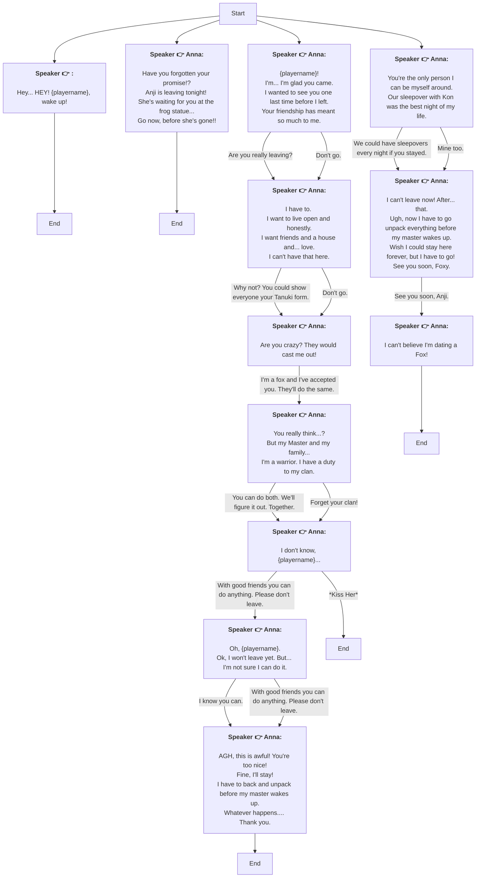

```mermaid
graph
Start -->1766672157337891[<b>Speaker 👉 :</b>
\nHey... HEY! &lbrace;playername&rbrace;, wake up!]
1766672157337891 -->1766681055228200[End]
Start -->1766681208037674[<b>Speaker 👉 Anna:</b>
\nHave you forgotten your promise!?\nAnji is leaving tonight! \nShe's waiting for you at the frog statue...\nGo now, before she's gone!!]
1766681208037674 -->1766685341910398[End]
Start -->1766681352883506[<b>Speaker 👉 Anna:</b>
\n&lbrace;playername&rbrace;!\nI'm... I'm glad you came.\nI wanted to see you one last time before I left.\nYour friendship has meant so much to me.]
1766681352883506 -->|Are you really leaving?|1766686399488482[<b>Speaker 👉 Anna:</b>
\nI have to. 
I want to live open and honestly.\nI want friends and a house and... love.\nI can't have that here.]
1766681352883506 -->|Don't go.|1766686399488482[<b>Speaker 👉 Anna:</b>
\nI have to. 
I want to live open and honestly.\nI want friends and a house and... love.\nI can't have that here.]
1766686399488482 -->|Why not? You could show everyone your Tanuki form.|1766686528492008[<b>Speaker 👉 Anna:</b>
\nAre you crazy? They would cast me out!]
1766686399488482 -->|Don't go.|1766686528492008[<b>Speaker 👉 Anna:</b>
\nAre you crazy? They would cast me out!]
1766686528492008 -->|I'm a fox and I've accepted you. They'll do the same.|1766686621164014[<b>Speaker 👉 Anna:</b>
\nYou really think...?\nBut my Master and my family...\nI'm a warrior. I have a duty to my clan.]
1766686621164014 -->|You can do both. We'll figure it out. Together.|1766686682965492[<b>Speaker 👉 Anna:</b>
\nI don't know, &lbrace;playername&rbrace;...]
1766686621164014 -->|Forget your clan!|1766686682965492[<b>Speaker 👉 Anna:</b>
\nI don't know, &lbrace;playername&rbrace;...]
1766686682965492 -->|With good friends you can do anything. Please don't leave.|1766686745538043[<b>Speaker 👉 Anna:</b>
\nOh, &lbrace;playername&rbrace;.\nOk, I won't leave yet. But... I'm not sure I can do it.]
1766686682965492 -->|*Kiss Her*|1766686807014913[End]
1766686745538043 -->|I know you can.|1766686821873154[<b>Speaker 👉 Anna:</b>
\nAGH, this is awful! You're too nice!\nFine, I'll stay!\nI have to back and unpack before my master wakes up.\nWhatever happens.... Thank you.]
1766686745538043 -->|With good friends you can do anything. Please don't leave.|1766686821873154[<b>Speaker 👉 Anna:</b>
\nAGH, this is awful! You're too nice!\nFine, I'll stay!\nI have to back and unpack before my master wakes up.\nWhatever happens.... Thank you.]
1766686821873154 -->1766686858170883[End]
Start -->1766686900719109[<b>Speaker 👉 Anna:</b>
\nYou're the only person I can be myself around.\nOur sleepover with Kon was the best night of my life.]
1766686900719109 -->|We could have sleepovers every night if you stayed.|1766686953551371[<b>Speaker 👉 Anna:</b>
\nI can't leave now! After... that.\nUgh, now I have to go unpack everything before my master wakes up.\nWish I could stay here forever, but I have to go! See you soon, Foxy.]
1766686900719109 -->|Mine too.|1766686953551371[<b>Speaker 👉 Anna:</b>
\nI can't leave now! After... that.\nUgh, now I have to go unpack everything before my master wakes up.\nWish I could stay here forever, but I have to go! See you soon, Foxy.]
1766686953551371 -->|See you soon, Anji.|1766687001349649[<b>Speaker 👉 Anna:</b>
\nI can't believe I'm dating a Fox!]
1766687001349649 -->1766687019647507[End]

```