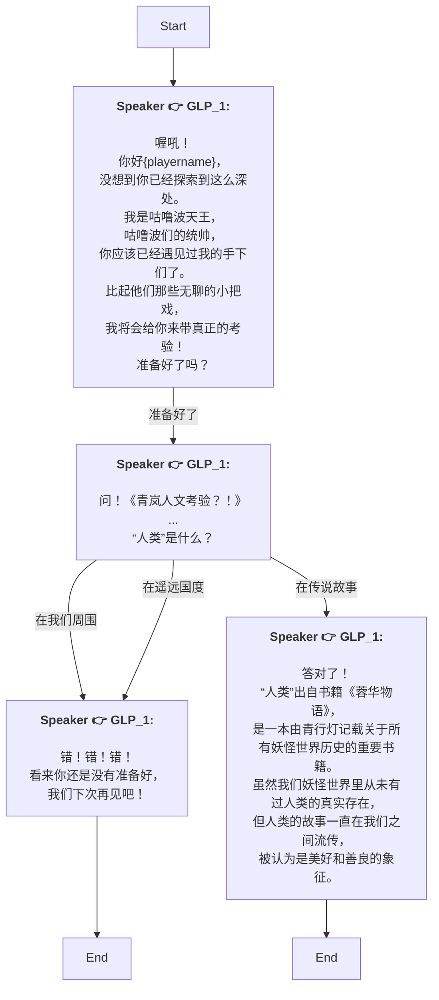

```mermaid
graph
Start -->1759525374602824[<b>Speaker 👉 GLP_1:</b>
\n喔吼！
你好&lbrace;playername&rbrace;，
没想到你已经探索到这么深处。\n我是咕噜波天王，
咕噜波们的统帅，
你应该已经遇见过我的手下们了。\n比起他们那些无聊的小把戏，
我将会给你来带真正的考验！
准备好了吗？]
1759525374602824 -->|准备好了|1759525703176780[<b>Speaker 👉 GLP_1:</b>
\n问！《青岚人文考验？！》
...
“人类”是什么？]
1759525703176780 -->|在我们周围|1759525952616021[<b>Speaker 👉 GLP_1:</b>
\n错！错！错！\n看来你还是没有准备好，
我们下次再见吧！]
1759525703176780 -->|在遥远国度|1759525952616021[<b>Speaker 👉 GLP_1:</b>
\n错！错！错！\n看来你还是没有准备好，
我们下次再见吧！]
1759525703176780 -->|在传说故事|1759526024569432[<b>Speaker 👉 GLP_1:</b>
\n答对了！\n“人类”出自书籍《蓉华物语》，
是一本由青行灯记载关于所有妖怪世界历史的重要书籍。\n虽然我们妖怪世界里从未有过人类的真实存在，
但人类的故事一直在我们之间流传，
被认为是美好和善良的象征。]
1759525952616021 -->1759526013052502[End]
1759526024569432 -->1759526016419415[End]

```