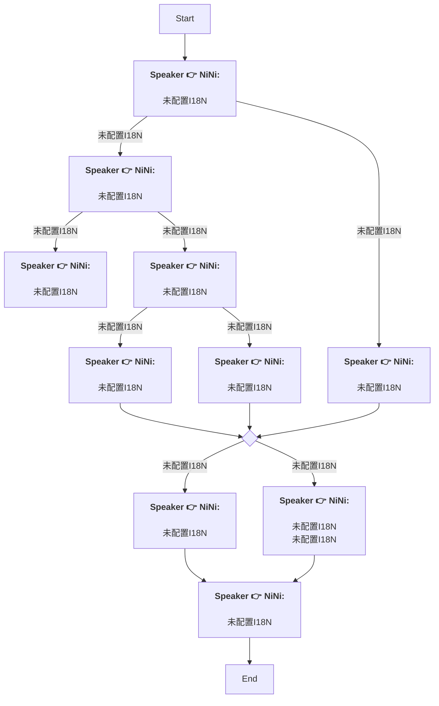

```mermaid
graph
Start -->1734737947222163[<b>Speaker 👉 NiNi:</b>
\n未配置I18N]
1734737947222163 -->|未配置I18N|1734738230151322[<b>Speaker 👉 NiNi:</b>
\n未配置I18N]
1734737947222163 -->|未配置I18N|1734738232433819[<b>Speaker 👉 NiNi:</b>
\n未配置I18N]
1734738232433819 -->|未配置I18N|1734738819357858[<b>Speaker 👉 NiNi:</b>
\n未配置I18N]
1734738232433819 -->|未配置I18N|1734738888408228[<b>Speaker 👉 NiNi:</b>
\n未配置I18N]
433684762183722 -->|未配置I18N|1734739265763508[<b>Speaker 👉 NiNi:</b>
\n未配置I18N\n未配置I18N]
433684762183722 -->|未配置I18N|1734739259156659[<b>Speaker 👉 NiNi:</b>
\n未配置I18N]
1734738888408228 -->|未配置I18N|1734739142748331[<b>Speaker 👉 NiNi:</b>
\n未配置I18N]
1734738888408228 -->|未配置I18N|1734739048734890[<b>Speaker 👉 NiNi:</b>
\n未配置I18N]
1734739048734890 -->433684762183722{ }
1734739259156659 -->1734739954331835[<b>Speaker 👉 NiNi:</b>
\n未配置I18N]
1734739954331835 -->1734740014229692[End]
1734739265763508 -->1734739954331835[<b>Speaker 👉 NiNi:</b>
\n未配置I18N]
1734739142748331 -->433684762183722{ }
1734738230151322 -->433684762183722{ }

```