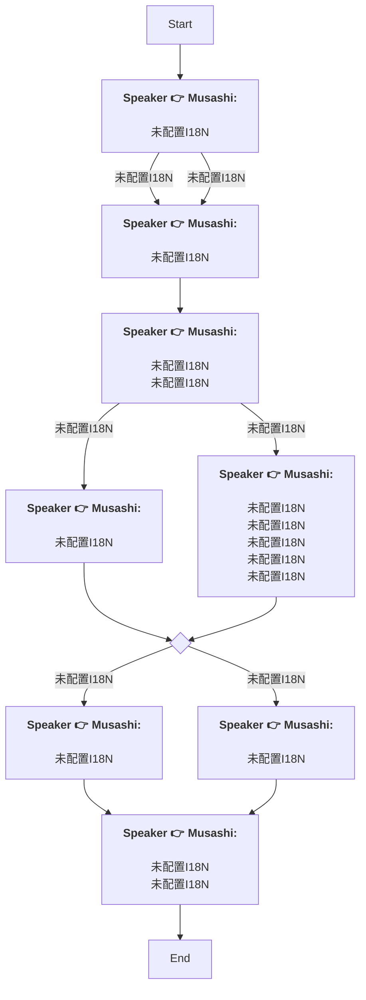

```mermaid
graph
Start -->1738912725988551[<b>Speaker 👉 Musashi:</b>
\n未配置I18N]
1738912725988551 -->|未配置I18N|1738977842280613[<b>Speaker 👉 Musashi:</b>
\n未配置I18N]
1738912725988551 -->|未配置I18N|1738977842280613[<b>Speaker 👉 Musashi:</b>
\n未配置I18N]
1738977842280613 -->1740664161411315[<b>Speaker 👉 Musashi:</b>
\n未配置I18N\n未配置I18N]
434744559668522 -->|未配置I18N|1738979238631604[<b>Speaker 👉 Musashi:</b>
\n未配置I18N]
434744559668522 -->|未配置I18N|1738979190730931[<b>Speaker 👉 Musashi:</b>
\n未配置I18N]
1740664161411315 -->|未配置I18N|1738978401349804[<b>Speaker 👉 Musashi:</b>
\n未配置I18N\n未配置I18N\n未配置I18N\n未配置I18N\n未配置I18N]
1740664161411315 -->|未配置I18N|1738978238674091[<b>Speaker 👉 Musashi:</b>
\n未配置I18N]
1738978238674091 -->434744559668522{ }
1738979190730931 -->1738979147702450[<b>Speaker 👉 Musashi:</b>
\n未配置I18N\n未配置I18N]
1738979147702450 -->1738912730366152[End]
1738979238631604 -->1738979147702450[<b>Speaker 👉 Musashi:</b>
\n未配置I18N\n未配置I18N]
1738978401349804 -->434744559668522{ }

```