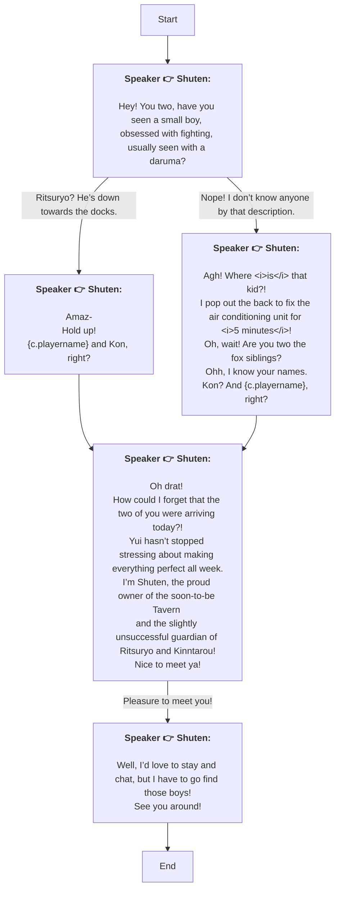

```mermaid
graph
Start -->1741906499870021[<b>Speaker 👉 Shuten:</b>
\nHey! You two, have you seen a small boy, obsessed with fighting, usually seen with a daruma?]
1741906499870021 -->|Ritsuryo? He’s down towards the docks.|1769060640365597[<b>Speaker 👉 Shuten:</b>
\nAmaz-
Hold up!
&lbrace;c.playername&rbrace; and Kon, right?]
1741906499870021 -->|Nope! I don’t know anyone by that description.|1777938747025968[<b>Speaker 👉 Shuten:</b>
\nAgh! Where &lt;i&gt;is&lt;/i&gt; that kid?!
I pop out the back to fix the air conditioning unit for &lt;i&gt;5 minutes&lt;/i&gt;!
Oh, wait! Are you two the fox siblings?\nOhh, I know your names.
Kon? And &lbrace;c.playername&rbrace;, right?]
1769060640365597 -->1777939019504179[<b>Speaker 👉 Shuten:</b>
\nOh drat! 
How could I forget that the two of you were arriving today?!\nYui hasn’t stopped stressing about making everything perfect all week.\nI’m Shuten, the proud owner of the soon-to-be Tavern 
and the slightly unsuccessful guardian of Ritsuryo and Kinntarou!
Nice to meet ya!]
1777939019504179 -->|Pleasure to meet you!|1777939094427198[<b>Speaker 👉 Shuten:</b>
\nWell, I’d love to stay and chat, but I have to go find those boys!
See you around!]
1777939094427198 -->1741908338957638[End]
1777938747025968 -->1777939019504179[<b>Speaker 👉 Shuten:</b>
\nOh drat! 
How could I forget that the two of you were arriving today?!\nYui hasn’t stopped stressing about making everything perfect all week.\nI’m Shuten, the proud owner of the soon-to-be Tavern 
and the slightly unsuccessful guardian of Ritsuryo and Kinntarou!
Nice to meet ya!]

```