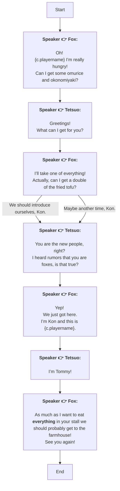

```mermaid
graph
Start -->1777941318007494[<b>Speaker 👉 Fox:</b>
\nOh! 
&lbrace;c.playername&rbrace; I’m really hungry!
Can I get some omurice and okonomiyaki?]
1777941318007494 -->1777941372076743[<b>Speaker 👉 Tetsuo:</b>
\nGreetings!
What can I get for you?]
1777941372076743 -->1777941397215945[<b>Speaker 👉 Fox:</b>
\nI’ll take one of everything!
Actually, can I get a double of the fried tofu?]
1777941397215945 -->|We should introduce ourselves, Kon.|1777941475492560[<b>Speaker 👉 Tetsuo:</b>
\nYou are the new people, right? 
I heard rumors that you are foxes, is that true?]
1777941397215945 -->|Maybe another time, Kon.|1777941475492560[<b>Speaker 👉 Tetsuo:</b>
\nYou are the new people, right? 
I heard rumors that you are foxes, is that true?]
1777941475492560 -->1777941539550931[<b>Speaker 👉 Fox:</b>
\nYep! 
We just got here.
I’m Kon and this is &lbrace;c.playername&rbrace;.]
1777941539550931 -->1777941768690390[<b>Speaker 👉 Tetsuo:</b>
\nI’m Tommy!]
1777941768690390 -->1777941777722073[<b>Speaker 👉 Fox:</b>
\nAs much as I want to eat <b>everything</b> in your stall we should probably get to the farmhouse!\nSee you again!]
1777941777722073 -->1741905938224452[End]

```