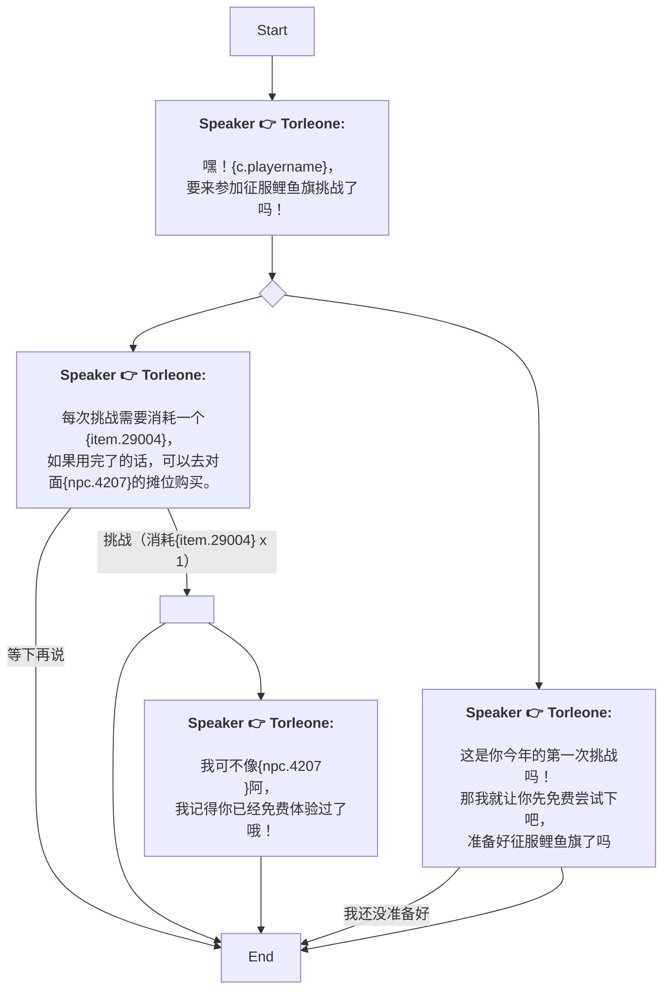

```mermaid
graph
Start -->1747827907015965[<b>Speaker 👉 Torleone:</b>
\n嘿！&lbrace;c.playername&rbrace;，
要来参加征服鲤鱼旗挑战了吗！]
1747827907015965 -->1752005422132562{ }
1752005422132562 -->1752005655631188[<b>Speaker 👉 Torleone:</b>
\n每次挑战需要消耗一个&lbrace;item.29004&rbrace;，
如果用完了的话，可以去对面&lbrace;npc.4207&rbrace;的摊位购买。]
1752005422132562 -->1752005877835099[<b>Speaker 👉 Torleone:</b>
\n这是你今年的第一次挑战吗！
那我就让你先免费尝试下吧，
准备好征服鲤鱼旗了吗]
1752005655631188 -->|挑战（消耗&lbrace;item.29004&rbrace; x 1）|1752005867783514[ ]
1752005655631188 -->|等下再说|1747827980024094[End]
1752005867783514 -->1752006146056546[<b>Speaker 👉 Torleone:</b>
\n我可不像&lbrace;npc.4207
&rbrace;阿，
我记得你已经免费体验过了哦！]
1752005867783514 -->1747827980024094[End]
1752006146056546 -->1747827980024094[End]
1752005877835099 -->|我还没准备好|1747827980024094[End]
1752005877835099 -->1747827980024094[End]

```