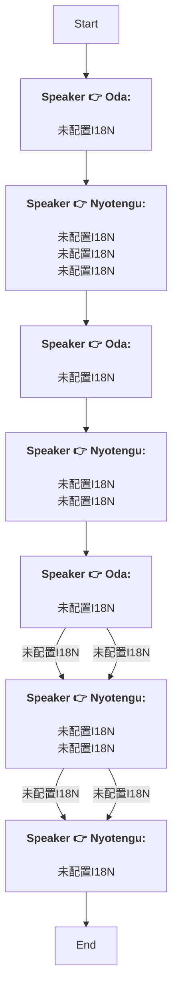

```mermaid
graph
Start -->1752703222234942[<b>Speaker 👉 Oda:</b>
\n未配置I18N]
1752703222234942 -->1752703263150911[<b>Speaker 👉 Nyotengu:</b>
\n未配置I18N\n未配置I18N\n未配置I18N]
1752703263150911 -->1752703753580352[<b>Speaker 👉 Oda:</b>
\n未配置I18N]
1752703753580352 -->1752703791298369[<b>Speaker 👉 Nyotengu:</b>
\n未配置I18N\n未配置I18N]
1752703791298369 -->1752703867654978[<b>Speaker 👉 Oda:</b>
\n未配置I18N]
1752703867654978 -->|未配置I18N|1752704207243080[<b>Speaker 👉 Nyotengu:</b>
\n未配置I18N\n未配置I18N]
1752703867654978 -->|未配置I18N|1752704207243080[<b>Speaker 👉 Nyotengu:</b>
\n未配置I18N\n未配置I18N]
1752704207243080 -->|未配置I18N|1752704391839567[<b>Speaker 👉 Nyotengu:</b>
\n未配置I18N]
1752704207243080 -->|未配置I18N|1752704391839567[<b>Speaker 👉 Nyotengu:</b>
\n未配置I18N]
1752704391839567 -->1752704505191249[End]

```