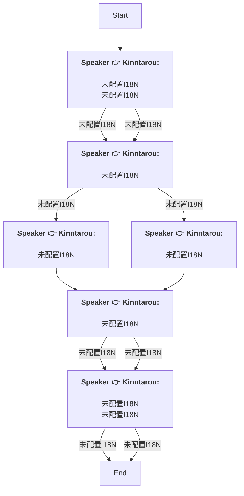

```mermaid
graph
Start -->1757635749222953[<b>Speaker 👉 Kinntarou:</b>
\n未配置I18N\n未配置I18N]
1757635749222953 -->|未配置I18N|1757636932786736[<b>Speaker 👉 Kinntarou:</b>
\n未配置I18N]
1757635749222953 -->|未配置I18N|1757636932786736[<b>Speaker 👉 Kinntarou:</b>
\n未配置I18N]
1757636932786736 -->|未配置I18N|1757637453221431[<b>Speaker 👉 Kinntarou:</b>
\n未配置I18N]
1757636932786736 -->|未配置I18N|1757637450996278[<b>Speaker 👉 Kinntarou:</b>
\n未配置I18N]
1757637450996278 -->1757637789079096[<b>Speaker 👉 Kinntarou:</b>
\n未配置I18N]
1757637789079096 -->|未配置I18N|1757638320759359[<b>Speaker 👉 Kinntarou:</b>
\n未配置I18N\n未配置I18N]
1757637789079096 -->|未配置I18N|1757638320759359[<b>Speaker 👉 Kinntarou:</b>
\n未配置I18N\n未配置I18N]
1757638320759359 -->|未配置I18N|1757638852615751[End]
1757638320759359 -->|未配置I18N|1757638852615751[End]
1757637453221431 -->1757637789079096[<b>Speaker 👉 Kinntarou:</b>
\n未配置I18N]

```