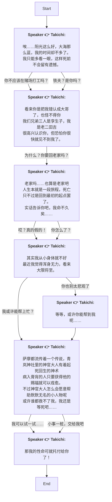

```mermaid
graph
Start -->1761452140830407[<b>Speaker 👉 Takichi:</b>
\n唉……阳光这么好，大海那么蓝，我的时间却不多了。
我只能多看一眼，这样死前不会留有遗憾。]
1761452140830407 -->|你不应该在赌场打工吗？|1761452523136717[<b>Speaker 👉 Takichi:</b>
\n看来你是把我错认成大哥了，也怪不得你
我们兄弟三人是孪生子，我是老二田吉
很高兴认识你，但恐怕你很快就见不到我了。]
1761452140830407 -->|铁夫？是你吗？|1761452523136717[<b>Speaker 👉 Takichi:</b>
\n看来你是把我错认成大哥了，也怪不得你
我们兄弟三人是孪生子，我是老二田吉
很高兴认识你，但恐怕你很快就见不到我了。]
1761452523136717 -->|为什么？你要回老家吗？|1761452795966161[<b>Speaker 👉 Takichi:</b>
\n老家吗……也算是老家吧
人生本就是一段旅程，死亡只不过是回到最初的起点罢了。
实话告诉你吧，我命不久矣……]
1761452795966161 -->|哎？真的假的！|1761453413620439[<b>Speaker 👉 Takichi:</b>
\n其实我从小身体就不好
最近我觉得浑身无力，看来大限将至。]
1761452795966161 -->|你怎么了？|1761453413620439[<b>Speaker 👉 Takichi:</b>
\n其实我从小身体就不好
最近我觉得浑身无力，看来大限将至。]
1761453413620439 -->|你也别太悲观了|1761456900277982[<b>Speaker 👉 Takichi:</b>
\n等等，或许你能帮到我呢……]
1761453413620439 -->|我或许能帮上忙？|1761456921394911[<b>Speaker 👉 Takichi:</b>
\n萨摩都流传着一个传说，青岚神社里的神官大人有着起死回生的神术
病入膏肓的人只要获得他的赐福就可以痊愈。
不过神官大人怎么会愿意帮助默默无名的小人物呢\n或许谁都救不了我，我还是等死吧……]
1761456921394911 -->|我可以试一试……|1761457274348261[<b>Speaker 👉 Takichi:</b>
\n那我的性命可就托付给你了！]
1761456921394911 -->|小事一桩，交给我吧|1761457274348261[<b>Speaker 👉 Takichi:</b>
\n那我的性命可就托付给你了！]
1761457274348261 -->1761457570014950[End]
1761456900277982 -->1761456921394911[<b>Speaker 👉 Takichi:</b>
\n萨摩都流传着一个传说，青岚神社里的神官大人有着起死回生的神术
病入膏肓的人只要获得他的赐福就可以痊愈。
不过神官大人怎么会愿意帮助默默无名的小人物呢\n或许谁都救不了我，我还是等死吧……]

```