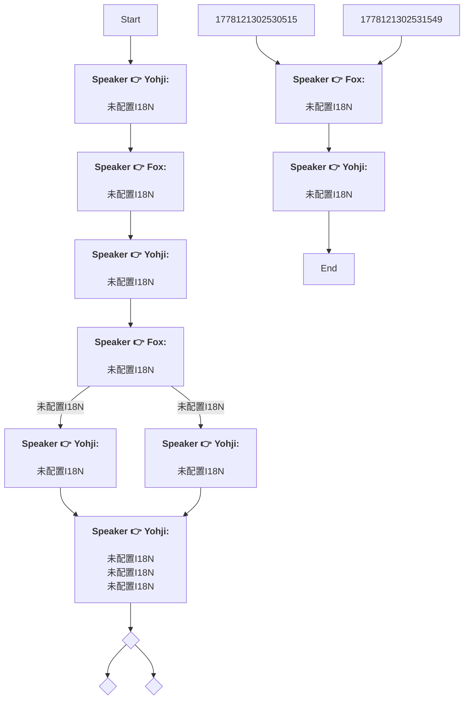

```mermaid
graph
Start -->1778121302527413[<b>Speaker 👉 Yohji:</b>
\n未配置I18N]
1778121302527413 -->1778121302527415[<b>Speaker 👉 Fox:</b>
\n未配置I18N]
1778121302527415 -->1778121302528442[<b>Speaker 👉 Yohji:</b>
\n未配置I18N]
1778121302528442 -->1778121302528445[<b>Speaker 👉 Fox:</b>
\n未配置I18N]
1778121302528445 -->|未配置I18N|1778121302532579[<b>Speaker 👉 Yohji:</b>
\n未配置I18N]
1778121302528445 -->|未配置I18N|1778121302529477[<b>Speaker 👉 Yohji:</b>
\n未配置I18N]
1778121302529477 -->1778121302529480[<b>Speaker 👉 Yohji:</b>
\n未配置I18N\n未配置I18N\n未配置I18N]
1778121302529480 -->1778121302530509{ }
1778121302530509 -->1778121302531553{ }
1778121302530509 -->1778121302530512{ }
1778121302530515 -->1778121302530518[<b>Speaker 👉 Fox:</b>
\n未配置I18N]
1778121302530518 -->1778121302531545[<b>Speaker 👉 Yohji:</b>
\n未配置I18N]
1778121302531545 -->1778121302531548[End]
1778121302531549 -->1778121302530518[<b>Speaker 👉 Fox:</b>
\n未配置I18N]
1778121302532579 -->1778121302529480[<b>Speaker 👉 Yohji:</b>
\n未配置I18N\n未配置I18N\n未配置I18N]

```