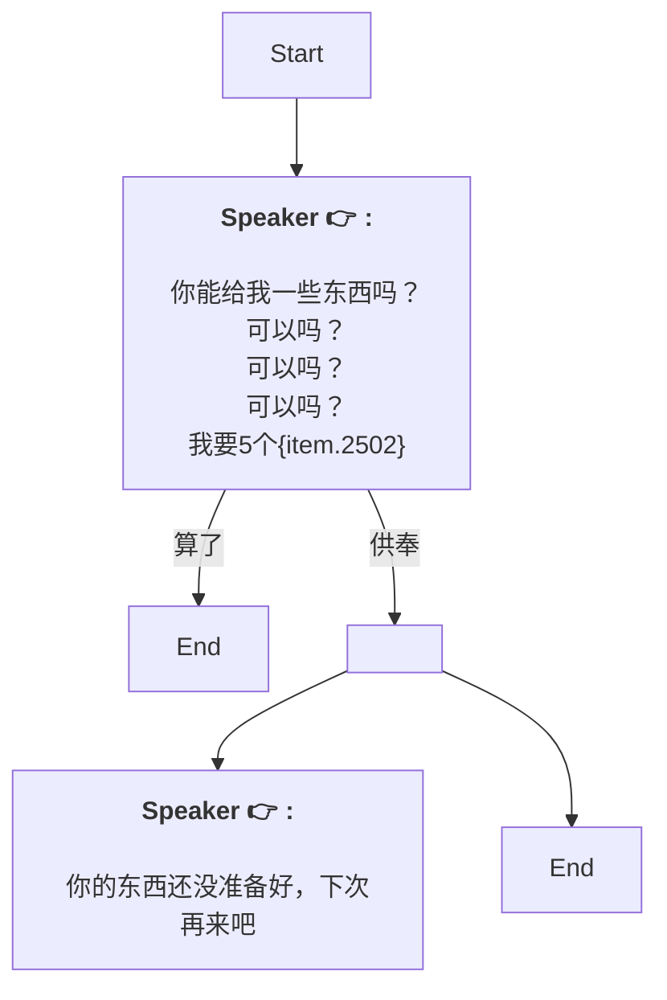

```mermaid
graph
Start -->1747217079082489[<b>Speaker 👉 :</b>
\n你能给我一些东西吗？\n可以吗？\n可以吗？\n可以吗？\n我要5个&lbrace;item.2502&rbrace;]
1747217079082489 -->|算了|1747217418224127[End]
1747217079082489 -->|供奉|1747217426350592[ ]
1747217426350592 -->1747217442807297[<b>Speaker 👉 :</b>
\n你的东西还没准备好，下次再来吧]
1747217426350592 -->1747217504330242[End]

```