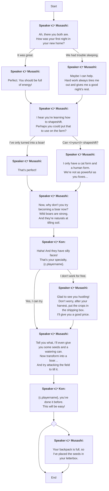

```mermaid
graph
Start -->1768881203408877[<b>Speaker 👉 Musashi:</b>
\nAh, there you both are.
How was your first night in your new home?]
1768881203408877 -->|It was great.|1768881350927347[<b>Speaker 👉 Musashi:</b>
\nPerfect. You should be full of energy!]
1768881203408877 -->|We had trouble sleeping.|1768881355970548[<b>Speaker 👉 Musashi:</b>
\nMaybe I can help. 
Hard work always tires me out and gives me a good night’s rest.]
1768881350927347 -->1768881410613237[<b>Speaker 👉 Musashi:</b>
\nI hear you’re learning how to shapeshift.
Perhaps you could put that to use on the farm?]
1768881410613237 -->|I’ve only turned into a boar!|1768881530854395[<b>Speaker 👉 Musashi:</b>
\nThat’s perfect!]
1768881410613237 -->|Can &lt;i&gt;you&lt;/i&gt; shapeshift?|1768881534680060[<b>Speaker 👉 Musashi:</b>
\nI only have a cat form and a human form.
We’re not as powerful as you foxes…]
1768881530854395 -->1768881575982077[<b>Speaker 👉 Musashi:</b>
\nNow, why don’t you try becoming a boar now? 
Wild boars are strong.
And they’re naturals at tilling soil.]
1768881575982077 -->1775536595490217[<b>Speaker 👉 Kon:</b>
\nHaha! And they have silly faces!
That’s your specialty, &lbrace;c.playername&rbrace;.]
1775536595490217 -->|Yes, I can try.|1776858636741257[<b>Speaker 👉 Musashi:</b>
\nTell you what, I’ll even give you some seeds and a watering can.
Now transform into a boar…
And try attacking the field to till it.]
1775536595490217 -->|I don’t work for free.|1775536721059257[<b>Speaker 👉 Musashi:</b>
\nGlad to see you hustling!
Don’t worry, after your harvest, put the crops in the shipping box.
I’ll give you a good price.]
1775536721059257 -->1776858636741257[<b>Speaker 👉 Musashi:</b>
\nTell you what, I’ll even give you some seeds and a watering can.
Now transform into a boar…
And try attacking the field to till it.]
1776858636741257 -->1776858669106828[<b>Speaker 👉 Kon:</b>
\n&lbrace;c.playername&rbrace;, you’ve done it before.
This will be easy!]
1776858669106828 -->1768881589887998{ }
1768881589887998 -->1768881632876543[End]
1768881589887998 -->1775452072571233[<b>Speaker 👉 Musashi:</b>
\nYour backpack is full, so I've placed the seeds in your letterbox.]
1775452072571233 -->1768881632876543[End]
1768881534680060 -->1768881575982077[<b>Speaker 👉 Musashi:</b>
\nNow, why don’t you try becoming a boar now? 
Wild boars are strong.
And they’re naturals at tilling soil.]
1768881355970548 -->1768881410613237[<b>Speaker 👉 Musashi:</b>
\nI hear you’re learning how to shapeshift.
Perhaps you could put that to use on the farm?]

```