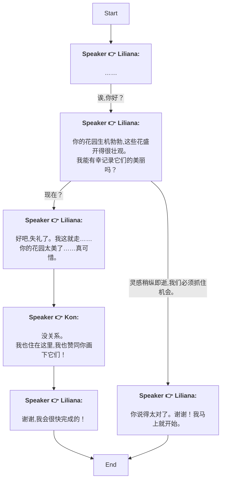

```mermaid
graph
Start -->1771104039739884[<b>Speaker 👉 Liliana:</b>
\n……]
1771104039739884 -->|诶,你好？|1771104039741935[<b>Speaker 👉 Liliana:</b>
\n你的花园生机勃勃,这些花盛开得很壮观。\n我能有幸记录它们的美丽吗？]
1771104039741935 -->|现在？|1771104039743987[<b>Speaker 👉 Liliana:</b>
\n好吧,失礼了。我这就走……\n你的花园太美了……真可惜。]
1771104039741935 -->|灵感稍纵即逝,我们必须抓住机会。|1771104039749112[<b>Speaker 👉 Liliana:</b>
\n你说得太对了。谢谢！我马上就开始。]
1771104039743987 -->1771104039746036[<b>Speaker 👉 Kon:</b>
\n没关系。
我也住在这里,我也赞同你画下它们！]
1771104039746036 -->1771104039747061[<b>Speaker 👉 Liliana:</b>
\n谢谢,我会很快完成的！]
1771104039747061 -->1771104039747062[End]
1771104039749112 -->1771104039747062[End]

```