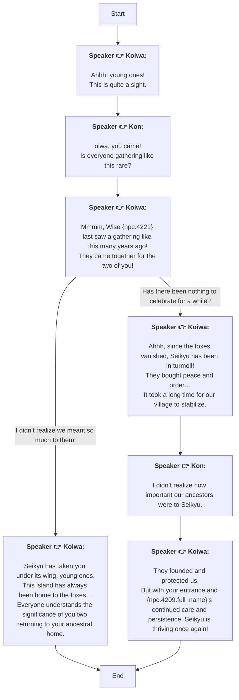

```mermaid
graph
Start -->1776844190160462[<b>Speaker 👉 Koiwa:</b>
\nAhhh, young ones! 
This is quite a sight.]
1776844190160462 -->1776844202961487[<b>Speaker 👉 Kon:</b>
\noiwa, you came!
Is everyone gathering like this rare?]
1776844202961487 -->1776844225110608[<b>Speaker 👉 Koiwa:</b>
\nMmmm, Wise &lbrace;npc.4221&rbrace; last saw a gathering like this many years ago!
They came together for the two of you!]
1776844225110608 -->|Has there been nothing to celebrate for a while?|1776844293295704[<b>Speaker 👉 Koiwa:</b>
\nAhhh, since the foxes vanished, Seikyu has been in turmoil!
They bought peace and order…
It took a long time for our village to stabilize.]
1776844225110608 -->|I didn’t realize we meant so much to them!|1776844265460311[<b>Speaker 👉 Koiwa:</b>
\nSeikyu has taken you under its wing, young ones.
This island has always been home to the foxes…
Everyone understands the significance of you two returning to your ancestral home.]
1776844265460311 -->1776844360302176[End]
1776844293295704 -->1776844311462490[<b>Speaker 👉 Kon:</b>
\nI didn’t realize how important our ancestors were to Seikyu.]
1776844311462490 -->1776844352280157[<b>Speaker 👉 Koiwa:</b>
\nThey founded and protected us.
But with your entrance and &lbrace;npc.4209.full_name&rbrace;’s continued care and persistence, Seikyu is thriving once again!]
1776844352280157 -->1776844360302176[End]

```