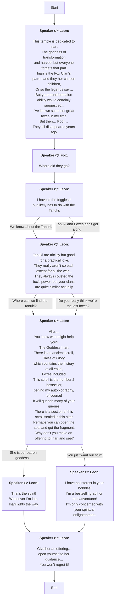

```mermaid
graph
Start -->1774711858257223[<b>Speaker 👉 Leon:</b>
\nThis temple is dedicated to Inari,
The goddess of transformation
and harvest but everyone forgets that part.\nInari is the Fox Clan’s patron and they her chosen children,
Or so the legends say…
But your transformation ability would certainly suggest so...\nI’ve known scores of great foxes in my time.
But then… Poof… 
They all disappeared years ago.]
1774711858257223 -->1774711928965451[<b>Speaker 👉 Fox:</b>
\nWhere did they go?]
1774711928965451 -->1774711959005517[<b>Speaker 👉 Leon:</b>
\nI haven’t the foggiest! 
but likely has to do with the Tanuki.]
1774711959005517 -->|We know about the Tanuki.|1774711996014934[<b>Speaker 👉 Leon:</b>
\nTanuki are tricksy but good for a practical joke.
They really aren’t so bad, except for all the war…\nThey always coveted the fox’s power, but your clans are quite similar actually.]
1774711959005517 -->|Tanuki and Foxes don’t get along.|1774711996014934[<b>Speaker 👉 Leon:</b>
\nTanuki are tricksy but good for a practical joke.
They really aren’t so bad, except for all the war…\nThey always coveted the fox’s power, but your clans are quite similar actually.]
1774711996014934 -->|Where can we find the Tanuki?|1774712059338080[<b>Speaker 👉 Leon:</b>
\nAha… 
You know who might help you?
The Goddess Inari.\nThere is an ancient scroll, Tales of Glory,
which contains the history of all Yokai,
Foxes included.\nThis scroll is the number 2 bestseller,
behind my autobiography, of course!
It will quench many of your queries.\nThere is a section of this scroll sealed in this altar.
Perhaps you can open the seal and get the fragment.
Why don’t you make an offering to Inari and see?]
1774711996014934 -->|Do you really think we’re the last foxes?|1774712059338080[<b>Speaker 👉 Leon:</b>
\nAha… 
You know who might help you?
The Goddess Inari.\nThere is an ancient scroll, Tales of Glory,
which contains the history of all Yokai,
Foxes included.\nThis scroll is the number 2 bestseller,
behind my autobiography, of course!
It will quench many of your queries.\nThere is a section of this scroll sealed in this altar.
Perhaps you can open the seal and get the fragment.
Why don’t you make an offering to Inari and see?]
1774712059338080 -->|She is our patron goddess…|1774712178897260[<b>Speaker 👉 Leon:</b>
\nThat’s the spirit!
Whenever I’m lost,
Inari lights the way.]
1774712059338080 -->|You just want our stuff!|1774712193587566[<b>Speaker 👉 Leon:</b>
\nI have no interest in your bobbles!
I’m a bestselling author and adventurer!
I’m only concerned with your spiritual enlightenment.]
1774712178897260 -->1774712239243632[<b>Speaker 👉 Leon:</b>
\nGive her an offering…
open yourself to her guidance…
You won’t regret it!]
1774712239243632 -->1774712270085490[End]
1774712193587566 -->1774712239243632[<b>Speaker 👉 Leon:</b>
\nGive her an offering…
open yourself to her guidance…
You won’t regret it!]

```