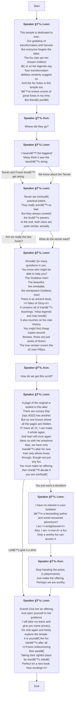

```mermaid
graph
Start -->1774711858257223[<b>Speaker 👉 Leon:</b>
\nThis temple is dedicated to Inari.
Our goddess of transformation and harvest.
But everyone forgets the latter.\nThe fox clan are her chosen children
… or so the legends say.\nYour transformation abilities certainly suggest so.
And the fox holes in this temple too.\nI’ve known scores of great foxes in my time.
But then… poof…]
1774711858257223 -->1774711928965451[<b>Speaker 👉 Kon:</b>
\nWhere did they go?]
1774711928965451 -->1774711959005517[<b>Speaker 👉 Leon:</b>
\nI haven’t the foggiest!
Many think it was the tanuki’s doing.]
1774711959005517 -->|Tanuki and Foxes don’t get along.|1774711996014934[<b>Speaker 👉 Leon:</b>
\nTanuki are tricksy… practical jokers.
They really aren’t so bad. 
But they always coveted the fox’s powers.\nIn the end, both clans are quite similar, actually.]
1774711959005517 -->|We know about the Tanuki.|1774711996014934[<b>Speaker 👉 Leon:</b>
\nTanuki are tricksy… practical jokers.
They really aren’t so bad. 
But they always coveted the fox’s powers.\nIn the end, both clans are quite similar, actually.]
1774711996014934 -->|Are we really the last foxes?|1774712059338080[<b>Speaker 👉 Leon:</b>
\nHmm… So many questions in you. 
You know who might be able to help you?
The Goddess Inari!\nThe beautiful, 
the inimitable,
the omnipotent Goddess Inari!\nThere is an ancient book, &lt;i&gt;Tales of Glory&lt;/i&gt;.
It contains all of Inari’s teachings. Yokai legends and Inari lore…
It also touches on fox clan history.\nYou might find cheap copies around.
Beware, those are just works of fiction.
The true version covers the 15 Inari Pillars.]
1774711996014934 -->|What do the tanuki want?|1774712059338080[<b>Speaker 👉 Leon:</b>
\nHmm… So many questions in you. 
You know who might be able to help you?
The Goddess Inari!\nThe beautiful, 
the inimitable,
the omnipotent Goddess Inari!\nThere is an ancient book, &lt;i&gt;Tales of Glory&lt;/i&gt;.
It contains all of Inari’s teachings. Yokai legends and Inari lore…
It also touches on fox clan history.\nYou might find cheap copies around.
Beware, those are just works of fiction.
The true version covers the 15 Inari Pillars.]
1774712059338080 -->1775607129549195[<b>Speaker 👉 Kon:</b>
\nHow do we get this scroll?]
1775607129549195 -->1775607159457168[<b>Speaker 👉 Leon:</b>
\nA page of the original is sealed in this altar.
There are rumors that &lbrace;npc.4202&rbrace; has another.
But no one knows where all the pages are hidden.\nIf I have all 15, I can make it whole again.
And Inari will once again bless us with her presence.\nAlas, we have only Inari’s altar for now.
Inari only allows foxes through, though not just any fox.
You must make an offering, then she’ll decide if you are worthy…]
1775607159457168 -->|You just want a donation!|1774712178897260[<b>Speaker 👉 Leon:</b>
\nI have no interest in your bobbles!
I’m a bestselling author and world-renowned adventurer!
I am &lt;i&gt;enlightened&lt;/i&gt;.\nAlso, I am &lt;i&gt;not&lt;/i&gt; a fox.
Only a worthy fox can access it.]
1775607159457168 -->|Let’s give it a shot.|1774712193587566[<b>Speaker 👉 Leon:</b>
\nGrand! Give her an offering,
And open yourself to her guidance.\nI will take my leave and give you some privacy.
Do visit again and freely explore the temple. 
It is yours… the fox clan’s after all.\n&lt;i&gt;Foxes rediscovering their past…
Taking their rightful place by Inari’s side…
Perfect for a new book. How exciting!&lt;/i&gt;]
1774712178897260 -->1775607202801046[<b>Speaker 👉 Kon:</b>
\nStop hassling the priest, &lbrace;c.playername&rbrace;.
Just make the offering. 
Perhaps we are worthy.]
1775607202801046 -->1774712193587566[<b>Speaker 👉 Leon:</b>
\nGrand! Give her an offering,
And open yourself to her guidance.\nI will take my leave and give you some privacy.
Do visit again and freely explore the temple. 
It is yours… the fox clan’s after all.\n&lt;i&gt;Foxes rediscovering their past…
Taking their rightful place by Inari’s side…
Perfect for a new book. How exciting!&lt;/i&gt;]
1774712193587566 -->1774712270085490[End]

```