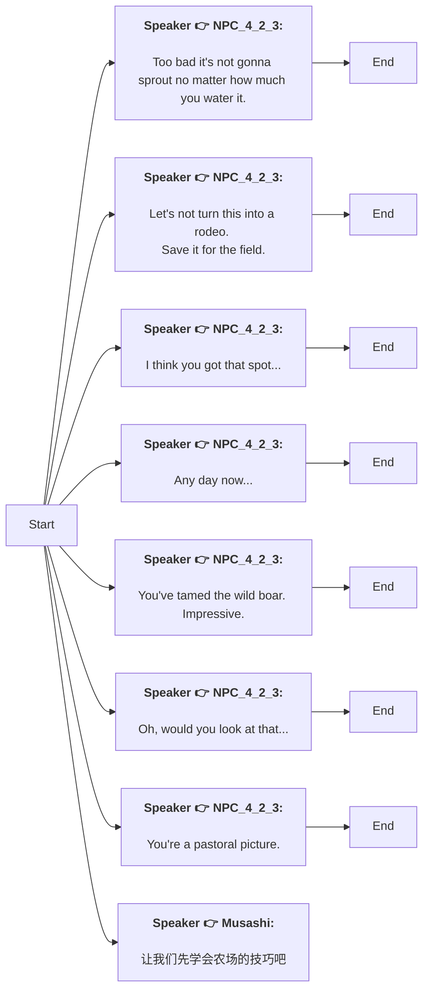

```mermaid
graph LR
Start -->1768884574776325[<b>Speaker 👉 NPC_4_2_3:</b>
\nToo bad it's not gonna sprout no matter how much you water it.]
1768884574776325 -->1768884429265923[End]
Start -->1768884774476813[<b>Speaker 👉 NPC_4_2_3:</b>
\nLet's not turn this into a rodeo. 
Save it for the field.]
1768884774476813 -->1768884678678536[End]
Start -->1768884787234830[<b>Speaker 👉 NPC_4_2_3:</b>
\nI think you got that spot...]
1768884787234830 -->1768884739463179[End]
Start -->1768884796445711[<b>Speaker 👉 NPC_4_2_3:</b>
\nAny day now...]
1768884796445711 -->1768884809496592[End]
Start -->1768884880899090[<b>Speaker 👉 NPC_4_2_3:</b>
\nYou've tamed the wild boar. Impressive.]
1768884880899090 -->1768884891209747[End]
Start -->1768884921164823[<b>Speaker 👉 NPC_4_2_3:</b>
\nOh, would you look at that...]
1768884921164823 -->1768884925259800[End]
Start -->1768884920385558[<b>Speaker 👉 NPC_4_2_3:</b>
\nYou're a pastoral picture.]
1768884920385558 -->1768884931682329[End]
Start -->1772535815119022[<b>Speaker 👉 Musashi:</b>
\n让我们先学会农场的技巧吧]

```