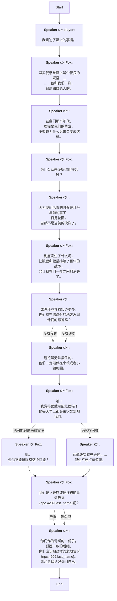

```mermaid
graph
Start -->1761914154096955[<b>Speaker 👉 player:</b>
\n我讲述了藤木的事情。]
1761914154096955 -->1761914208560445[<b>Speaker 👉 Fox:</b>
\n其实我感觉藤木是个善良的妖怪……
……他和我们一样，
都是独自长大的。]
1761914208560445 -->1761914176858428[<b>Speaker 👉 :</b>
\n在我们那个年代，
狸猫是我们的挚友，
不知道为什么后来会变成这样。]
1761914176858428 -->1761914238160190[<b>Speaker 👉 Fox:</b>
\n为什么从来没听你们提起过？]
1761914238160190 -->1761914250049855[<b>Speaker 👉 :</b>
\n因为我们活着的时候是几千年前的事了，
日月轮回，
自然不是当初的模样了。]
1761914250049855 -->1761914266264896[<b>Speaker 👉 Fox:</b>
\n到底发生了什么呢，
让狐狸和狸猫持续了百年的战争，
又让狐狸们一夜之间都消失了。]
1761914266264896 -->1761914284779841[<b>Speaker 👉 :</b>
\n或许那些狸猫知道更多，
你们有在遗迹外的地方发现他们的踪迹吗？]
1761914284779841 -->|没有发现|1761914321836360[<b>Speaker 👉 :</b>
\n遗迹是无法居住的，
他们一定潜伏在小镇或者小镇周围。]
1761914284779841 -->|没有线索|1761914321836360[<b>Speaker 👉 :</b>
\n遗迹是无法居住的，
他们一定潜伏在小镇或者小镇周围。]
1761914321836360 -->1761914336786761[<b>Speaker 👉 Fox:</b>
\n哈！
我觉得武藏可能是狸猫！
他每天早上都会来农舍监视我们。]
1761914336786761 -->|他可能只是来取货吧|1761914365450575[<b>Speaker 👉 Fox:</b>
\n呃，
但你不能排除有这个可能！]
1761914336786761 -->|确实很可疑|1761914443819346[<b>Speaker 👉 :</b>
\n武藏确实有些奇怪……
但也不要打草惊蛇。]
1761914365450575 -->1761914371688784[<b>Speaker 👉 Fox:</b>
\n我们是不是应该把狸猫的事情告诉&lbrace;npc.4209.last_name&rbrace;呢？]
1761914371688784 -->|告诉|1761914485231961[<b>Speaker 👉 :</b>
\n你们作为青岚的一份子，
狐狸一族的后继，
你们应该把这样的危险告诉&lbrace;npc.4209.last_name&rbrace;。\n请注意保护好你们自己。]
1761914371688784 -->|先保密|1761914485231961[<b>Speaker 👉 :</b>
\n你们作为青岚的一份子，
狐狸一族的后继，
你们应该把这样的危险告诉&lbrace;npc.4209.last_name&rbrace;。\n请注意保护好你们自己。]
1761914485231961 -->1761914621797722[End]
1761914443819346 -->1761914371688784[<b>Speaker 👉 Fox:</b>
\n我们是不是应该把狸猫的事情告诉&lbrace;npc.4209.last_name&rbrace;呢？]

```