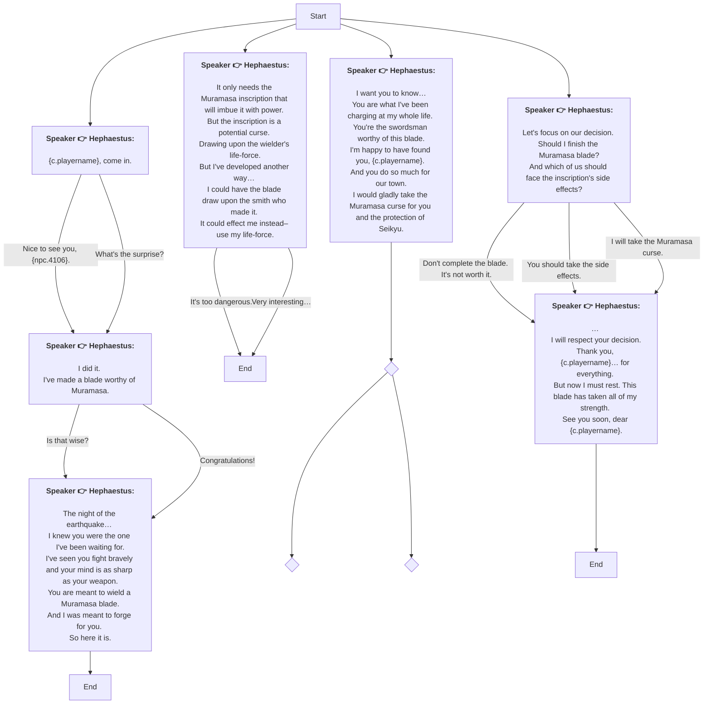

```mermaid
graph
Start -->1772421744271544[<b>Speaker 👉 Hephaestus:</b>
\n&lbrace;c.playername&rbrace;, come in.]
1772421744271544 -->|Nice to see you, &lbrace;npc.4106&rbrace;.|1772421781827779[<b>Speaker 👉 Hephaestus:</b>
\nI did it. 
I've made a blade worthy of Muramasa.]
1772421744271544 -->|What's the surprise?|1772421781827779[<b>Speaker 👉 Hephaestus:</b>
\nI did it. 
I've made a blade worthy of Muramasa.]
1772421781827779 -->|Is that wise?|1772421820084425[<b>Speaker 👉 Hephaestus:</b>
\nThe night of the earthquake… 
I knew you were the one I've been waiting for.\nI've seen you fight bravely and your mind is as sharp as your weapon.
You are meant to wield a Muramasa blade.\nAnd I was meant to forge for you. 
So here it is.]
1772421781827779 -->|Congratulations!|1772421820084425[<b>Speaker 👉 Hephaestus:</b>
\nThe night of the earthquake… 
I knew you were the one I've been waiting for.\nI've seen you fight bravely and your mind is as sharp as your weapon.
You are meant to wield a Muramasa blade.\nAnd I was meant to forge for you. 
So here it is.]
1772421820084425 -->1772421902826698[End]
Start -->1772421948112076[<b>Speaker 👉 Hephaestus:</b>
\nIt only needs the Muramasa inscription that will imbue it with power. 
But the inscription is a potential curse. 
Drawing upon the wielder's life-force.\nBut I've developed another way… 
I could have the blade draw upon the smith who made it. 
It could effect me instead– use my life-force.]
1772421948112076 -->|It's too dangerous.|1772422011820242[End]
1772421948112076 -->|Very interesting…|1772422011820242[End]
Start -->1772422039150804[<b>Speaker 👉 Hephaestus:</b>
\nI want you to know…
You are what I've been charging at my whole life. 
You're the swordsman worthy of this blade.\nI'm happy to have found you, &lbrace;c.playername&rbrace;. 
And you do so much for our town.\nI would gladly take the Muramasa curse for you and the protection of Seikyu.]
1772422039150804 -->1772608256421121{ }
1772608256421121 -->1772608290431235{ }
1772608256421121 -->1772422088348885{ }
Start -->1772422202278110[<b>Speaker 👉 Hephaestus:</b>
\nLet's focus on our decision. 
Should I finish the Muramasa blade?
And which of us should face the inscription's side effects?]
1772422202278110 -->|Don't complete the blade. It's not worth it.|1772422395537639[<b>Speaker 👉 Hephaestus:</b>
\n… 
I will respect your decision.\nThank you, &lbrace;c.playername&rbrace;… for everything. 
But now I must rest. This blade has taken all of my strength. 
See you soon, dear &lbrace;c.playername&rbrace;.]
1772422202278110 -->|You should take the side effects.|1772422395537639[<b>Speaker 👉 Hephaestus:</b>
\n… 
I will respect your decision.\nThank you, &lbrace;c.playername&rbrace;… for everything. 
But now I must rest. This blade has taken all of my strength. 
See you soon, dear &lbrace;c.playername&rbrace;.]
1772422202278110 -->|I will take the Muramasa curse.|1772422395537639[<b>Speaker 👉 Hephaestus:</b>
\n… 
I will respect your decision.\nThank you, &lbrace;c.playername&rbrace;… for everything. 
But now I must rest. This blade has taken all of my strength. 
See you soon, dear &lbrace;c.playername&rbrace;.]
1772422395537639 -->1772422461375720[End]

```