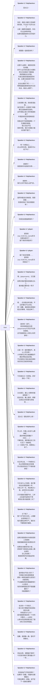

```mermaid
graph LR
Start -->1727669208028345[<b>Speaker 👉 Hephaestus:</b>
\n回头见！]
Start -->1727669228803259[<b>Speaker 👉 Hephaestus:</b>
\n你好，我是小镇的工匠赫菲斯托斯，不过这个名字太长了
大家一般都叫我赫菲，你也可以这样称呼我。
如果有需要我帮忙的尽管开口。]
Start -->1727669228804285[<b>Speaker 👉 Hephaestus:</b>
\n想跟我一起练肌肉吗？]
Start -->1727669265736895[<b>Speaker 👉 Hephaestus:</b>
\n这里什么都好，就是消息有些闭塞。
前不久业内知名锻刀大赛的举办方给我发了邀请函
希望我能去当评委。\n可是当我收到邀请函的时候，比赛已经结束半年多了……\n这也太离谱了吧！！！！
明明是超级难得的技术交流机会，就这么浪费了。]
Start -->1727669265736897[<b>Speaker 👉 Hephaestus:</b>
\n父亲是矮人族，母亲是渴血族……
他们的孩子一定是两个种族都无法接纳和包容的。\n这件事我从很小的时候就知道了
毕竟固有观念是很难改变的。\n但是这并不妨碍我拥有一个充满爱的家庭。
阻力无处不在
很多时候，我们只是缺少面对的勇气罢了。]
Start -->1727669712214211[<b>Speaker 👉 Hephaestus:</b>
\n呀！你真贴心……
这么好的东西，我真的可以收下吗？]
Start -->1727669712214213[<b>Speaker 👉 Hephaestus:</b>
\n谢谢你！
我很喜欢你送我的东西……]
Start -->1727669712214215[<b>Speaker 👉 Hephaestus:</b>
\n谢谢你……
我们之间不用这么客气的。]
Start -->1727669712214217[<b>Speaker 👉 Hephaestus:</b>
\n虽然你能送礼物给我，我很感激……
但是收到这个我也很困扰呀！]
Start -->1727669712215243[<b>Speaker 👉 Hephaestus:</b>
\n你是在故意羞辱我吗？]
Start -->1727669712215245[<b>Speaker 👉 player:</b>
\n感觉和&lbrace;npc.4106.first_name&rbrace;的关系更加密切了……
接下来好好相处吧！]
Start -->1727669712215247[<b>Speaker 👉 player:</b>
\n做了多余的事情……
感觉和&lbrace;npc.4106.first_name&rbrace;的关系疏远了！]
Start -->1750913663781145[<b>Speaker 👉 Hephaestus:</b>
\n嘿，&lbrace;playername&rbrace;，又见面了。
前两天我好像有些锻炼过头了，
看来最近要休息一阵子了……]
Start -->1751446334634282[<b>Speaker 👉 Hephaestus:</b>
\n嗯……应该是这样没错，不过好像也不太对劲。
啊！抱歉，我刚刚在想钢材配比的事情，有些走神了。]
Start -->1751446658345260[<b>Speaker 👉 Hephaestus:</b>
\n是你呀！真巧……
其实刚刚我还在想&lbrace;playername&rbrace;今天会不会来找我呢。
这可能就是友人间的心有灵犀吧！]
Start -->1753041040684836[<b>Speaker 👉 Hephaestus:</b>
\n又是一年一度的鲤鱼节，真让人怀念啊！
小时候村正师父每逢鲤鱼节都会带我去逛庆典。
不过我现在只能记起庆典现场买的红豆柏饼的味道……]
Start -->1753042058365733[<b>Speaker 👉 Hephaestus:</b>
\n今天就忘记一切烦恼，好好放松一下吧！]
Start -->1754981984533008[<b>Speaker 👉 Hephaestus:</b>
\n炎炎夏日，最让人期待的就是祭典了！
趁此机会，戴上面具，顺便忘掉往日的琐事与烦恼吧……]
Start -->1754982933656081[<b>Speaker 👉 Hephaestus:</b>
\n回头见！要玩得开心呀！]
Start -->1756859381660193[<b>Speaker 👉 Hephaestus:</b>
\n早上好，你看上去没什么精神呢……
莫非昨晚没有睡好？
（呵欠……）\n不瞒你说，我昨晚也在工坊忙活了一整夜呢。
人一旦放松下来，困意就上来了。]
Start -->1756860676656676[<b>Speaker 👉 Hephaestus:</b>
\n村正师父说，一个称职的工匠必须拥有强壮的体魄
所以我总是会在下午锻炼身体呢！]
Start -->1756926446448167[<b>Speaker 👉 Hephaestus:</b>
\n今天没什么订单呢，我打算待会去酒馆里喝一杯。
辛苦工作一天，然后喝点小酒，这样的生活太美妙了……\n只可惜我的酒量不好，三杯之后就开始神志不清
再恢复意识就是第二天了]
Start -->1756928046077482[<b>Speaker 👉 Hephaestus:</b>
\n又下雨了……
整个天气阴沉沉的，心情都会变得低沉了。
每次遇到这种天气，我的关节都隐隐作痛呢。]
Start -->1756928373282348[<b>Speaker 👉 Hephaestus:</b>
\n前两天我隐隐约约闻到很诱人的香味
我就循着香味的来源到处寻找
结果差点撞到织田小姐……\n原来那个香味是从她身上飘出来的
怎么形容呢？
像是某种好吃的甜品的味道。]
Start -->1757728986413649[<b>Speaker 👉 Hephaestus:</b>
\n虽然我也不是小孩子了
可是每次来到酒馆喝酒
都有一种害怕被师父抓现行的感觉呢。\n不过越是紧张刺激越是吸引人去尝试……
有的时候喝酒反而不是最重要的了
你能理解吗？]
Start -->1758010727046748[<b>Speaker 👉 Hephaestus:</b>
\n告诉你一个冷知识……
一般工匠们聚集的地区都会诞生名酒
你知道为什么吗？\n因为酿酒和锻造有一个共同关键点——山泉水
山泉水的品质直接决定了酒水和刀剑优秀程度。]
Start -->1758011532116578[<b>Speaker 👉 Hephaestus:</b>
\n抱歉，我想静一静，暂时不想聊天。]
Start -->1758080850982448[<b>Speaker 👉 Hephaestus:</b>
\n幸运女神，请赐福于我吧！
今天我可做好打算准备大干一场……]
Start -->1758081818299954[<b>Speaker 👉 Hephaestus:</b>
\n你知道运气守恒定律吗？
如果你一直赢，你最终会慢慢输光
可是如果你一直输，说不定下一盘就会赢哦！]

```