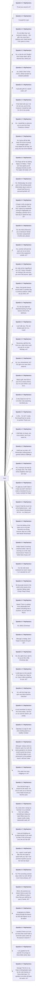

```mermaid
graph LR
Start -->1775339959591886[<b>Speaker 👉 Hephaestus:</b>
\nI'll see you around, eh?]
Start -->1775339959591890[<b>Speaker 👉 Hephaestus:</b>
\nFarewell for now!]
Start -->1775339959591894[<b>Speaker 👉 Hephaestus:</b>
\nIt's not often that I am stunned to silence... this gift is far more than I deserve and I shall cherish it for years to come.]
Start -->1775339959591898[<b>Speaker 👉 Hephaestus:</b>
\nHo, is this for me? Really? I don't know what I did to deserve this, thank you!]
Start -->1775339959591902[<b>Speaker 👉 Hephaestus:</b>
\nHo, what is this? A fine choice, please accept my deepest gratitude.]
Start -->1775339959591906[<b>Speaker 👉 Hephaestus:</b>
\nA peculiar gift for a sword smith, eh?]
Start -->1775339959591910[<b>Speaker 👉 Hephaestus:</b>
\nI'll be frank with you! I do not see any use for this, however, it would be rude for me to not accept.]
Start -->1775339959591914[<b>Speaker 👉 Hephaestus:</b>
\nHo, I would like to welcome you to your first Carp Festival on Seikyu!]
Start -->1775339959591918[<b>Speaker 👉 Hephaestus:</b>
\nHo, look at all the little ones! Oh to be so young and energetic again... I must depart for the day, but enjoy the rest of the festival!]
Start -->1775339959591922[<b>Speaker 👉 Hephaestus:</b>
\nThe forge will be my lasting legacy on Seikyu. I hope you have goals you're charging towards as well. The higher the better, eh?]
Start -->1775339959591926[<b>Speaker 👉 Hephaestus:</b>
\nHo, Wednesday, the center point of the working week! What better day to work on oneself and focus on personal growth, eh?]
Start -->1775339959591930[<b>Speaker 👉 Hephaestus:</b>
\nA forge is only as good as it's raw materials. That's why I spend my weekends mining for highquality ore. Swinging a pickaxe isn't a bad way to spend the day, eh?]
Start -->1775339959591934[<b>Speaker 👉 Hephaestus:</b>
\nHo, the cherry blossoms are in full bloom! Winter has been vanquished! Another pint, please!]
Start -->1775339959590914[<b>Speaker 👉 Hephaestus:</b>
\nHo, summer will soon be upon us! Let us move some of this equipment outside, eh?]
Start -->1775339959590918[<b>Speaker 👉 Hephaestus:</b>
\nHo, look at this magnificent ore, eh? I know I shouldn't be mining in the ruins but you won't tell anyone, right?]
Start -->1775339959590922[<b>Speaker 👉 Hephaestus:</b>
\nMmm, that gentle breeze would make it a perfect day to workout outdoors. What do you think, eh?]
Start -->1775339959590926[<b>Speaker 👉 Hephaestus:</b>
\nHo, the suns light has deprated leaving my forge alone to fend of the darkness.]
Start -->1775339959590930[<b>Speaker 👉 Hephaestus:</b>
\nI can't talk now. The rain always puts me in a... mood.]
Start -->1775339959590934[<b>Speaker 👉 Hephaestus:</b>
\nReceiving a gift like this from you, what more could one ask for on their Birthday, eh?]
Start -->1775339959590938[<b>Speaker 👉 Hephaestus:</b>
\nHo, you remembered, eh?  This gift is far more than I deserve.]
Start -->1775339959590942[<b>Speaker 👉 Hephaestus:</b>
\nWhat a gift, how kind of you! It's a curious choice, but I'm sure I'll find a use for it.]
Start -->1775339959590946[<b>Speaker 👉 Hephaestus:</b>
\nIs this meant for me? It's not what I was expecting, but thank you.]
Start -->1775339959590950[<b>Speaker 👉 Hephaestus:</b>
\nIs this... for me? I rarely find myself lost for words ... it's perfect! Thank you!]
Start -->1775339959590954[<b>Speaker 👉 Hephaestus:</b>
\nI shall take my leave, you know where I am if you need me.]
Start -->1775339959590958[<b>Speaker 👉 Hephaestus:</b>
\nI shall see you later, eh? Remember nothing great is granted without challenge.]
Start -->1775339959590962[<b>Speaker 👉 Hephaestus:</b>
\nHo, I must go, but stop by my forge soon. The metal shines brightest when you are near!]
Start -->1775339959590966[<b>Speaker 👉 Hephaestus:</b>
\nI'm glad you could make it! I hope you don't mind but I made a Koinobori for you. I hung it outside the forge!]
Start -->1775339959590970[<b>Speaker 👉 Hephaestus:</b>
\nI haven't had this much fun at the festival since... well, since Master Muramasa left me... so, thank you!]
Start -->1775339959590974[<b>Speaker 👉 Hephaestus:</b>
\nI love the feeling of the warm sun on my skin. Reminds me of long Summer days as a child with Master Muramasa!]
Start -->1775339959590978[<b>Speaker 👉 Hephaestus:</b>
\nAmber leaves crunching underfoot while I take my morning run in the crisp Autumnal air! There's no better time of year, eh?]
Start -->1775339959590982[<b>Speaker 👉 Hephaestus:</b>
\nHo, the cold never bothered me much. Guess I run naturally hot, eh?]
Start -->1775339959590986[<b>Speaker 👉 Hephaestus:</b>
\nMy favourate sound in the world is the sound of my hammer hitting metal. Ching! Ching! Ching!]
Start -->1775339959590990[<b>Speaker 👉 Hephaestus:</b>
\nWaste! There is nothing more despicable than waste! Everything has a purpose, you just have to find it!]
Start -->1775339959590994[<b>Speaker 👉 Hephaestus:</b>
\nHo, Merry Christmas!]
Start -->1775339959590998[<b>Speaker 👉 Hephaestus:</b>
\nAlthough a holiday, don't forget to stop by the gym, eh?]
Start -->1775339959591002[<b>Speaker 👉 Hephaestus:</b>
\nHo, the sight of you warms me up on this chilly Christmas day!]
Start -->1775339959591006[<b>Speaker 👉 Hephaestus:</b>
\nI shall return to the warmth of my forge now. Stop by as I have a little something for you, eh?]
Start -->1775339959591010[<b>Speaker 👉 Hephaestus:</b>
\nHo, with the forge now open any help would be welcome!]
Start -->1775339959591014[<b>Speaker 👉 Hephaestus:</b>
\nI must remember to stop by the mines today, I am low on ore and the week is yet young.]
Start -->1775339959591018[<b>Speaker 👉 Hephaestus:</b>
\nSaturday is a day for rest and resetting back to a healthy mindset.]
Start -->1775339959591022[<b>Speaker 👉 Hephaestus:</b>
\nAlthough I always strive to improve upon my craft, the clarity granted to me during recent events has shown me that the blade in your possession is the greatest sword I will ever make.]
Start -->1775339959591026[<b>Speaker 👉 Hephaestus:</b>
\nThis week has been dragging on, eh?]
Start -->1775339959591030[<b>Speaker 👉 Hephaestus:</b>
\nNow that the forge is closed for the week I am free to train you on the arts of the blade should you feel the need.]
Start -->1775339959591034[<b>Speaker 👉 Hephaestus:</b>
\nHo, every time I swing my hammer it is a reminder that I am crafting something to keep you safe! What more of a reason could a lowly blacksmith need, eh?]
Start -->1775339959591038[<b>Speaker 👉 Hephaestus:</b>
\nI was just heading out &lbrace;c.playername&rbrace;! If you need my later I'll be at the gym once the sun has set!]
Start -->1775339959591042[<b>Speaker 👉 Hephaestus:</b>
\nHo, I regret I could spare little time this week to spend with you. But I now promise myself to you for the next two days!]
Start -->1775339959591046[<b>Speaker 👉 Hephaestus:</b>
\nHo! The scorching summer days make my work all that much more arduous, eh?]
Start -->1775339959591050[<b>Speaker 👉 Hephaestus:</b>
\nMmm, the summer sun doesn't feel as warm this year! Without it what is there that can melt the icy jaws of winter, eh?]
Start -->1775339959591054[<b>Speaker 👉 Hephaestus:</b>
\nImaginging my blades slicing through the leaves as they fall inspires me to do better!]
Start -->1775339959591058[<b>Speaker 👉 Hephaestus:</b>
\nI wonder if there is an ore out there that could make a sword the same colour as the leaves in Autumn.?]
Start -->1775339959591062[<b>Speaker 👉 Hephaestus:</b>
\nI am grateful for the warmth of my forge on these bitter winter days.]
Start -->1775339959591066[<b>Speaker 👉 Hephaestus:</b>
\nStrange! The fire in my forge is being beaten back by the cold clutches of these dark days. If it splutters out what will keep me warm, eh?]

```