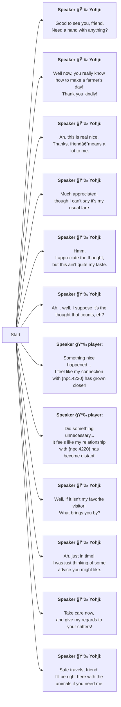

```mermaid
graph LR
Start -->1727291147077752[<b>Speaker 👉 Yohji:</b>
\nGood to see you, friend. 
Need a hand with anything?]
Start -->1727291569675400[<b>Speaker 👉 Yohji:</b>
\nWell now, you really know how to make a farmer's day! 
Thank you kindly!]
Start -->1727291569674366[<b>Speaker 👉 Yohji:</b>
\nAh, this is real nice. 
Thanks, friend—means a lot to me.]
Start -->1727291569674368[<b>Speaker 👉 Yohji:</b>
\nMuch appreciated, 
though I can't say it's my usual fare.]
Start -->1727291569675396[<b>Speaker 👉 Yohji:</b>
\nHmm, 
I appreciate the thought, 
but this ain't quite my taste.]
Start -->1727291569675394[<b>Speaker 👉 Yohji:</b>
\nAh... well, I suppose it's the thought that counts, eh?]
Start -->1772340586200233[<b>Speaker 👉 player:</b>
\nSomething nice happened... 
I feel like my connection with &lbrace;npc.4220&rbrace; has grown closer!]
Start -->1727291569676426[<b>Speaker 👉 player:</b>
\nDid something unnecessary...
It feels like my relationship with &lbrace;npc.4220&rbrace; has become distant!]
Start -->1727291716105364[<b>Speaker 👉 Yohji:</b>
\nWell, if it isn't my favorite visitor! 
What brings you by?]
Start -->1756938432158782[<b>Speaker 👉 Yohji:</b>
\nAh, just in time! 
I was just thinking of some advice you might like.]
Start -->1758882749960786[<b>Speaker 👉 Yohji:</b>
\nTake care now, 
and give my regards to your critters!]
Start -->1758882753961555[<b>Speaker 👉 Yohji:</b>
\nSafe travels, friend. 
I'll be right here with the animals if you need me.]

```