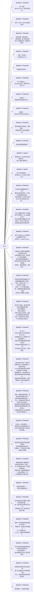

```mermaid
graph LR
Start -->1727291147076724[<b>Speaker 👉 Musashi:</b>
\n唷！老板。
想买点什么吗？会给你优惠的。]
Start -->1727291147076726[<b>Speaker 👉 Musashi:</b>
\n你好！有什么可以为你效劳的吗？]
Start -->1727291147077752[<b>Speaker 👉 Musashi:</b>
\n物美价廉，童叟无欺。
我叫武藏，是小镇的货郎
有什么需要记得一定要来找我啊！]
Start -->1727291147077754[<b>Speaker 👉 Musashi:</b>
\n老板，你来啦！
今天想来点什么？]
Start -->1727291438940284[<b>Speaker 👉 Musashi:</b>
\n有事随时来找我……]
Start -->1727291569674366[<b>Speaker 👉 Musashi:</b>
\n呀！你真贴心……
这么好的东西，我真的可以收下吗？]
Start -->1727291569674368[<b>Speaker 👉 Musashi:</b>
\n谢谢你！
我很喜欢你送我的东西……]
Start -->1727291569675394[<b>Speaker 👉 Musashi:</b>
\n谢谢你……
我们之间不用这么客气的。]
Start -->1727291569675396[<b>Speaker 👉 Musashi:</b>
\n虽然你能送礼物给我，我很感激……
但是收到这个我也很困扰呀！]
Start -->1727291569675398[<b>Speaker 👉 Musashi:</b>
\n你是在故意羞辱我吗？]
Start -->1727291569675400[<b>Speaker 👉 player:</b>
\n感觉和&lbrace;npc.4203&rbrace;的关系更加密切了……
接下来好好相处吧！]
Start -->1727291569676426[<b>Speaker 👉 player:</b>
\n做了多余的事情……
感觉和&lbrace;npc.4203&rbrace;的关系疏远了！]
Start -->1727291716105364[<b>Speaker 👉 Musashi:</b>
\n你应该见过獭里昂老大了吧？
虽然长得凶神恶煞，小孩子们却都很喜欢他呢。
不知道我老了之后会不会变成讨小孩子喜欢的大叔呢……]
Start -->1753033796998940[<b>Speaker 👉 Musashi:</b>
\n今天小镇很热闹吧？毕竟鲤鱼节可是青岚一年一度的重大节日！
传说中鲤鱼只要越过龙门经过考验，就可以升格为龙。
这真是非常吉利的象征啊！]
Start -->1753035128592157[<b>Speaker 👉 Musashi:</b>
\n别忘了去找&lbrace;npc.4206&rbrace;报名参加鲤鱼节活动……
玩得开心，&lbrace;playername&rbrace;。]
Start -->1756938432158782[<b>Speaker 👉 Musashi:</b>
\n不是所有人都有机会摆脱过去开启新生活的
从某种程度上来说，我们两个人其实很像呢。\n要不是青岚能接纳我们
或许我们现在还在哪个角落里流浪
别误会，我的意思是，你很幸运。]
Start -->1756941066785862[<b>Speaker 👉 Musashi:</b>
\n你有没有觉得织田镇长并不像表面看起来那么简单？
当然，我只是八卦一下。
并没有什么恶意……\n毕竟一个人不可能完美无缺，如果她真的看起来完美无缺
一定是为了隐藏什么秘密。]
Start -->1756941191416905[<b>Speaker 👉 Musashi:</b>
\n告诉你个秘密，其实我在青岚的生意都是友情价
完全不赚钱的……
最多只是持平。\n毕竟大家这么信任我，我怎么好意思赚大家的钱呢
当然，我有别的收入来源。
不必为我的生活担忧。]
Start -->1756949268805708[<b>Speaker 👉 Musashi:</b>
\n早上好！
你也应该差不多习惯青岚的生活了吧。
这里虽然比不上四国和九州的热闹繁华……\n但是这里有着最难得的悠闲和自在
不用考虑尔虞我诈和勾心斗角
也不用担心交不起下个月的房租。]
Start -->1756950644137039[<b>Speaker 👉 Musashi:</b>
\n我在京都生活过一段时间
那里的风土人情给我留下了很深的印象。
不过让我印象最深的还是传统风情的下午茶歇。\n即便是现在，我也经常托京都的朋友给我带当地的和菓子。
每每吃到这些和菓子，都好像回到了过去在京都的时光。]
Start -->1757013227238482[<b>Speaker 👉 Musashi:</b>
\n美酒、赌博这两样东西，很适合用来消磨时光吧？
尤其是寂寞的漫漫长夜……
不过，我还是劝你不要太过沉迷于享乐比较好。\n我亲眼见过深陷其中的家伙
那两样东西可都是深渊一般的存在。
你要是觉得自己可以抵挡诱惑可就大错特错了。]
Start -->1757013464181844[<b>Speaker 👉 Musashi:</b>
\n又是让人讨厌的晴天……
我是真的讨厌暴露在阳光下
这会让我感觉被什么锐利目光灼烧着。]
Start -->1757013626560600[<b>Speaker 👉 Musashi:</b>
\n我还挺享受在雨中独自漫步的感觉
这种氛围感真是太棒了
好像我一下子就变成了遗世而独立的侠客]
Start -->1757738132271703[<b>Speaker 👉 Musashi:</b>
\n能喝到酒吞小姐酿的酒
可是非常幸运的一件事……
听上去很夸张对吧？可是这是事实哦！\n我敢打赌，就算是稻荷神大人来到这里喝上一杯
也会跟我说出同样的话。]
Start -->1758070072263213[<b>Speaker 👉 Musashi:</b>
\n别赖在我这里了……
干嘛不去喝两杯呢？]
Start -->1758070108711471[<b>Speaker 👉 Musashi:</b>
\n岛外的朋友也对酒吞小姐的佳作很感兴趣……
我一直在努力促成双方的合作
可惜酒吞小姐一直没有这方面的兴趣。]
Start -->1758089051778653[<b>Speaker 👉 Musashi:</b>
\n哦呀？你也是想来这里碰碰运气的吗？
不瞒你说，这里似乎有种魔力
让人不愿离开呢……\n小心点，别被贪念吞噬殆尽了。]
Start -->1758090103277151[<b>Speaker 👉 Musashi:</b>
\n你不觉得这样规模的赌场出现在青岚很奇怪吗？
你有没有想过……
或许赌场真正的主人身份很特别？]
Start -->1758178510372433[<b>Speaker 👉 Musashi:</b>
\n我曾参加过很多地方的夏日祭
每个地区都有自己的特色和气氛
不过，我还是最喜欢青岚的夏日祭。]
Start -->1758178871818835[<b>Speaker 👉 Musashi:</b>
\n祝你拥有一个美好的夜晚。]

```