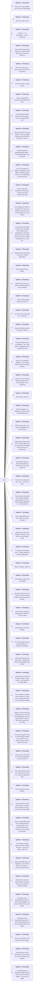

```mermaid
graph LR
Start -->1730217004590177[<b>Speaker 👉 Nyotengu:</b>
\nTengu do not say goodbye, we say until we meet again.]
Start -->1730217216536675[<b>Speaker 👉 Nyotengu:</b>
\nMay Inari smile on you.]
Start -->1730233993071725[<b>Speaker 👉 Nyotengu:</b>
\nLittle Fox... I'm speachless... I love it. Thank you.]
Start -->1730233993072751[<b>Speaker 👉 Nyotengu:</b>
\nYou must be paying close attention to know the right gift to give. Thank you, Little Fox.]
Start -->1730233993072753[<b>Speaker 👉 Nyotengu:</b>
\nThank you very much. I have a good spot for this in my armoury.]
Start -->1730233993072755[<b>Speaker 👉 Nyotengu:</b>
\nThis doesn't befit a Tengu warrior.]
Start -->1730233993073781[<b>Speaker 👉 Nyotengu:</b>
\nI hope my apprentice would know me better than that.]
Start -->1753123160870296[<b>Speaker 👉 Nyotengu:</b>
\nThe fluttering Koinobori remind me of war flags... are they serving alcohol yet?]
Start -->1753123460401561[<b>Speaker 👉 Nyotengu:</b>
\nDid you two have fun at the festival? There is a dragon waiting to burst forth from young Kon, I know it.]
Start -->1775162815304726[<b>Speaker 👉 Nyotengu:</b>
\nAnother long day of guarding sleepy Seikyu... I'll be drinking later if you care to join.]
Start -->1775163103296538[<b>Speaker 👉 Nyotengu:</b>
\nFox ruin monsters are hardly a challenge, the real battle is cleaning up their remains. Is one good fight too much to ask?]
Start -->1775163107154971[<b>Speaker 👉 Nyotengu:</b>
\nNot now, Little Fox. Saturdays are for prayer - a warrior must also condition their spirit.]
Start -->1775164372485149[<b>Speaker 👉 Nyotengu:</b>
\nDon't distract me while I'm on lookout. Oh, who am I kidding? Just once I wish to see warships out on the horizon.]
Start -->1775164416326688[<b>Speaker 👉 Nyotengu:</b>
\nI've explored a few levels of these ruins, but Tengu aren't meant for the underground. I need blue skies above so I can take off at any moment. I'll leave the depths to you, Little Fox.]
Start -->1775164420689953[<b>Speaker 👉 Nyotengu:</b>
\nMaybe we don't tell anyone I was here. Ok, little apprentice?]
Start -->1775164711722024[<b>Speaker 👉 Nyotengu:</b>
\nAnother peaceful day... boring...]
Start -->1775164732277801[<b>Speaker 👉 Nyotengu:</b>
\nWhen the sun has set, a warrior should be twice as wary of ambush.]
Start -->1775164532912166[<b>Speaker 👉 Nyotengu:</b>
\nI... I don't feel like talking right now, Little Fox.]
Start -->1775166031622193[<b>Speaker 👉 Nyotengu:</b>
\nYou know me so well, Little Fox. Thank you!]
Start -->1775166031623219[<b>Speaker 👉 Nyotengu:</b>
\nWhat a thoughtful present. Thank you, Little fox.]
Start -->1775166031624245[<b>Speaker 👉 Nyotengu:</b>
\nA warrior shouldn't focus on birthdays... yet I must admit, I thought you knew me better than this.]
Start -->1775166031624247[<b>Speaker 👉 Nyotengu:</b>
\nTengu do not celebrate birthdays... this present makes me wish I kept that practice.]
Start -->1775166031625275[<b>Speaker 👉 Nyotengu:</b>
\nLittle Fox! This is the best birthday present I have ever received. You're wonderful!]
Start -->1775166218007617[<b>Speaker 👉 Nyotengu:</b>
\nTill next time, Little Fox.]
Start -->1775166226185284[<b>Speaker 👉 Nyotengu:</b>
\nWe'll meet again, my Mighty Fox. May your foes tremble before you!]
Start -->1775166218007618[<b>Speaker 👉 Nyotengu:</b>
\nCome see me soon - my days are brightest when you're around.]
Start -->1775166486298698[<b>Speaker 👉 Nyotengu:</b>
\nHappy Carp Festival, Little Fox. I'd like to walk arm in arm and watch the children with you, but I'm on security duty...]
Start -->1775166486299724[<b>Speaker 👉 Nyotengu:</b>
\nThe festival makes me dream about having a family of our own. How unlike me!]
Start -->1775166589369426[<b>Speaker 👉 Nyotengu:</b>
\nSummer is the season of war...sigh...I miss those days.]
Start -->1775166628730970[<b>Speaker 👉 Nyotengu:</b>
\nThe leaves are turning the color of blood. Shall we make believe we're on a blood-soaked battlefield? No... that'd be silly.]
Start -->1775166633910364[<b>Speaker 👉 Nyotengu:</b>
\nArmour gets brittle in the cold - better for cutting through it.]
Start -->1775166811015263[<b>Speaker 👉 Nyotengu:</b>
\nWeapons and wine, the stronger the better. That's the key to any Tengu's heart.]
Start -->1775166820796512[<b>Speaker 👉 Nyotengu:</b>
\nA suitor gave me flowers once... I almost killed him. What a useless gift.]
Start -->1775172156249857[<b>Speaker 👉 Nyotengu:</b>
\nMerry Christmas, Little Fox.]
Start -->1775172164922114[<b>Speaker 👉 Nyotengu:</b>
\nDon't forget to train. Even on holidays!]
Start -->1775172166556419[<b>Speaker 👉 Nyotengu:</b>
\nMy heart soars to see you, Little Fox. You're the only present I wish to receive on this day.]
Start -->1775172173178628[<b>Speaker 👉 Nyotengu:</b>
\nCome find me under the mistletoe later, Little Fox. That's an order.]
Start -->1775176516281286[<b>Speaker 👉 Nyotengu:</b>
\nMy apprentice should be training.]
Start -->1775176516281288[<b>Speaker 👉 Nyotengu:</b>
\nThe curse weighs heavy on me today, Little Fox. I never liked Tuesdays...]
Start -->1775176516282314[<b>Speaker 👉 Nyotengu:</b>
\nI find myself praying more these days. I actually look forward to Saturdays at the temple.]
Start -->1775176919658446[<b>Speaker 👉 Nyotengu:</b>
\nI can't believe you beat me in single combat. I want a rematch - one day when I'm feeling better.]
Start -->1775176919658448[<b>Speaker 👉 Nyotengu:</b>
\nYou've made me a proud sensei, Little Fox. I think we've earned another dip in the hot springs tonight.]
Start -->1775176919659474[<b>Speaker 👉 Nyotengu:</b>
\nSeikyu is lucky to have you watching over it. I can rest easy knowing the town is in good hands. Of course, Nine Tails' 'goods' don't hurt either.]
Start -->1775176955845588[<b>Speaker 👉 Nyotengu:</b>
\nOn these long guard hours, my mind always wanders to you, Little Fox. You make a woman want to abandon her post.]
Start -->1775176955845590[<b>Speaker 👉 Nyotengu:</b>
\nI'm busy now. Come find me in the hot spring later, my lovely Little Fox.]
Start -->1775176955846616[<b>Speaker 👉 Nyotengu:</b>
\nI find myself asking Inari for more time with you, Little Fox. I hope she grants my wish.]
Start -->1775179389253594[<b>Speaker 👉 Nyotengu:</b>
\nThis rainy season seems endless...]
Start -->1775179411370972[<b>Speaker 👉 Nyotengu:</b>
\nI fear this will be my last rainy season. If only the rain were drops of wine... at least then I'd die happy.]
Start -->1775179522039776[<b>Speaker 👉 Nyotengu:</b>
\nThere's nothing better than warm mulled wine after training all day. Let's indulge ourselves this evening--if you can hold your alcohol.]
Start -->1775179522039778[<b>Speaker 👉 Nyotengu:</b>
\nThe seasons' change makes one think of those they love... Don't you agree, Little Fox?]
Start -->1775179604273124[<b>Speaker 👉 Nyotengu:</b>
\nKeep your blade sharp, my apprentice. I can feel this winter in my bones... I won't be around forever.]
Start -->1775179604274150[<b>Speaker 👉 Nyotengu:</b>
\nWinter is the season of death. Makes me want to get cozy by a fire with someone special.]
Start -->1777896872633746[<b>Speaker 👉 Nyotengu:</b>
\nThis place is like a beautiful painting isn't it? I love serene paintings, I've even collected a few...don't laugh.]
Start -->1777899356714390[<b>Speaker 👉 Nyotengu:</b>
\nThis place is like a beautiful painting isn't it? I love serene paintings, I've even collected a few...don't laugh.]
Start -->1777899498529178[<b>Speaker 👉 Nyotengu:</b>
\nCan you smell that? I can't stand the smell of eggs...]
Start -->1777899700467102[<b>Speaker 👉 Nyotengu:</b>
\nTengu have no use for fabric dyes. The only color we use is the blood of our enemies.]
Start -->1777899732709794[<b>Speaker 👉 Nyotengu:</b>
\nI could really go for a chargrilled kebab right now. I once snuck one into the temple... Leon was not happy.]

```