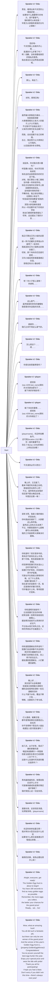

```mermaid
graph LR
Start -->1730212391192667[<b>Speaker 👉 Oda:</b>
\n贵安。看得出来今天您的心情很好呢……
如果有什么需要帮忙的地方，请不要客气。
随时都可以来找我！\n毕竟为大家服务是我的分内之事嘛！]
Start -->1730213165787229[<b>Speaker 👉 Oda:</b>
\n您好呀~
今天您看上去格外开心呢……
是遇到什么好事了吗？\n啊！抱歉，没有想要窥探您的隐私的意思。
我总是会忘记边界感这回事呢。]
Start -->1730217004590177[<b>Speaker 👉 Oda:</b>
\n那么，再会了。]
Start -->1730217216536675[<b>Speaker 👉 Oda:</b>
\n好的，那再见咯~]
Start -->1730218968869989[<b>Speaker 👉 Oda:</b>
\n虽然被大家推选为镇长……
但是我很清楚
大家都是看在父亲大人的面子上才认可我的。\n不过我可不会就此消沉！
父亲的光辉历史永远属于父亲
而我，会创造属于自己的辉煌。\n总之，我会努力让大家真正认可我的。
以后就请多多关照啦。]
Start -->1730220994965607[<b>Speaker 👉 Oda:</b>
\n说起来，你对甜点感兴趣吗？
听狐穗小姐说，你对烹饪很有研究
有机会的话真想和你好好交流下呢。\n对啦，我打算在小镇二期规划中建一所烘焙学校。
现在正在我的社交账号上做前期预热和招生。
反响意外得热烈呢！\n不瞒你说，我之前在网路上也算是小有名气
“织田亲的烘焙教室”是我的个人频道
深受大家信赖和喜爱\n所以一听说要开线下的培训学校
粉丝们都很积极得报名了
哎呀，远远超出了我的计划……]
Start -->1730233744481387[<b>Speaker 👉 Oda:</b>
\n我正打算去艾玛小姐的店里玩呢！
前一阵子武藏先生帮我从外面带了一批布料
我就送到艾玛小姐那边定做衣服了。\n哎呀，那个布料的花色很可爱呢……
艾玛小姐说用来做蓬蓬裙正合适。
想想还有点小激动呢！]
Start -->1730233993071725[<b>Speaker 👉 Oda:</b>
\n呀！你小子很上道嘛！
多谢啦……]
Start -->1730233993072751[<b>Speaker 👉 Oda:</b>
\n这么客气……
虽然我很欣赏你的慷慨啦
我很喜欢你送我的东西……]
Start -->1730233993072753[<b>Speaker 👉 Oda:</b>
\n谢谢你……
我们之间不用这么客气的。]
Start -->1730233993072755[<b>Speaker 👉 Oda:</b>
\n怎么是这个……
啧……]
Start -->1730233993073781[<b>Speaker 👉 Oda:</b>
\n你是在故意羞辱我吗？]
Start -->1730233993073783[<b>Speaker 👉 player:</b>
\n感觉和&lbrace;npc.4209.last_name&rbrace;镇长的关系更加密切了……
接下来好好相处吧！]
Start -->1730233993073785[<b>Speaker 👉 player:</b>
\n做了多余的事情……
感觉和&lbrace;npc.4209.last_name&rbrace;镇长的关系疏远了！]
Start -->1753123160870296[<b>Speaker 👉 Oda:</b>
\n&lbrace;playername&rbrace;，欢迎参加鲤鱼节。
这可是&lbrace;location.13&rbrace;小镇一年一度的重要节日
别忘了去&lbrace;npc.4206&rbrace;的摊位上参加活动哦！]
Start -->1753123460401561[<b>Speaker 👉 Oda:</b>
\n今天请务必尽兴而归！]
Start -->1757029480119432[<b>Speaker 👉 Oda:</b>
\n晚上好，又见面了。
看来今晚您有消遣之处呢。
那就祝您玩得开心吧！\n不过，虽然青岚治安很好
但还是不要太晚回去哦……
毕竟安全第一嘛！]
Start -->1757029824382093[<b>Speaker 👉 Oda:</b>
\n请多关照，我是小镇的镇长织田由衣。
你叫我由衣就好了，大家都这么称呼我。\n虽然这么说有点太自满了
不过，你要是遇到什么困难都可以来找我哦。
我的工作就是帮大家解决问题嘛。]
Start -->1730229309007977[<b>Speaker 👉 Oda:</b>
\n你知道吗？其实很多年前，青岚还不是现在这么冷清。
那个时候，青岚是狐狸们的家园。
织田家和狐狸们的友谊从上古时代就开始了。\n狐狸们守护青岚，织田家负责守护狐狸。
可是似乎在我祖父那辈的时候，出了什么变故。
狐狸们都消失了……\n现在身为织田家的一员，我还是想好好履行职责。
守护着这片土地，等待狐狸们回来。]
Start -->1757037204773016[<b>Speaker 👉 Oda:</b>
\n你知道晴天娃娃吗？
过去狐狸们还在的时候
经常会做一些晴天娃娃挂在屋檐上。\n据说晴天娃娃可以用来祈求好天气
不过自从他们消失之后，这样的传统似乎也被遗忘了。]
Start -->1757037426456730[<b>Speaker 👉 Oda:</b>
\n你知道狐狸嫁女的传说吗？
狐狸们会选择像今天这样的雨天举办婚嫁的仪式
新娘们会穿着白无垢，坐上轿子前往远方。\n据说遇到狐狸嫁女，人们都要回避呢。]
Start -->1757989735854647[<b>Speaker 👉 Oda:</b>
\n晚上好……
其实我不太会喝酒呢
但是我又很想跟大家聊天\n姨妈会给我特别调制一些无酒精的饮料
什么干姜汽水啦，覆盆子果汁啦……
嘿嘿，主要是为了参与感。]
Start -->1757990030330425[<b>Speaker 👉 Oda:</b>
\n灯火酒绿，觥筹交错……
都市爱情故事往往都是这么发生的
你不觉得两个陌生的人就此相遇坠入爱河很浪漫吗？]
Start -->1757990760116796[<b>Speaker 👉 Oda:</b>
\n前几天，出于好奇，我试了姨妈新酿的酒
喝起来就像果汁一样甜美
但是当我恢复意识已经是第二天下午了。\n这是什么加速时间流逝的魔法道具吗？!]
Start -->1758097679938149[<b>Speaker 👉 Oda:</b>
\n青岚越来越热闹，按理说我应该开心才对
可是赌场建成到底算好事还是坏事呢？
我时常担心这一切会失控。]
Start -->1758100491311719[<b>Speaker 👉 Oda:</b>
\n漫漫长夜，总该找些消遣。
玩得愉快呀，&lbrace;playername&rbrace;]
Start -->1758249243877977[<b>Speaker 👉 Oda:</b>
\n欢迎你来参加夏日祭！
我对举办大型活动没什么经验
如果有什么意见或者建议尽管提出来哦……]
Start -->1758249694724699[<b>Speaker 👉 Oda:</b>
\n难得的庆典，请务必要玩得开心呀！]
Start -->1769153395688482[<b>Speaker 👉 Oda:</b>
\nAlright, everyone, get ready! 
The Golden Egg Hunt is about to begin!\nYou have 180 seconds to find as many golden eggs as possible.
Remember, the more eggs you collect, 
the better your chances for the grand prize!\nReady... set... Go!]
Start -->1769153431311396[<b>Speaker 👉 Oda:</b>
\nWow, what an amazing hunt! 
You all did such a fantastic job, 
but there can only be one winner of the grand prize!\nAnd the winner of this year's Golden Egg Hunt is... 
&lbrace;property.GoldenEggWinner&rbrace;!\nCongratulations! 
You've proven yourself the best egg hunter this year. 
Enjoy your special prize and wear the title with pride!\nThank you all for participating! 
I hope you had a blast. 
Don't worry if you didn't win this time—there's always next year!]

```