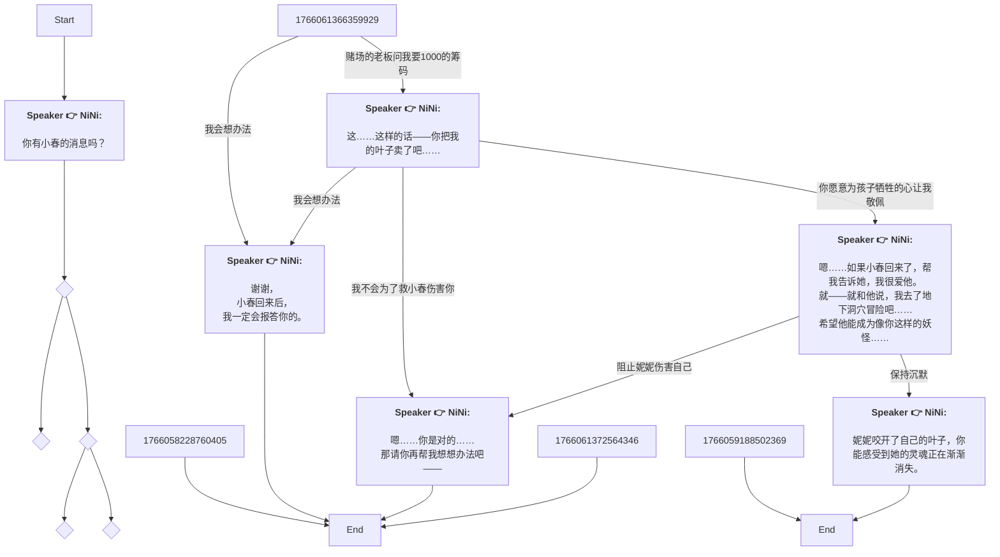

```mermaid
graph
Start -->1766058228759378[<b>Speaker 👉 NiNi:</b>
\n你有小春的消息吗？]
1766058228759378 -->1766058184354637{ }
1766058184354637 -->1766058228759380{ }
1766058184354637 -->1766060995138419{ }
1766058228760405 -->1766058228761430[End]
1766059188502369 -->1766059416893282[End]
1766060995138419 -->1766058832767834{ }
1766060995138419 -->1766061220162424{ }
1766061366359929 -->|我会想办法|1766061455267712[<b>Speaker 👉 NiNi:</b>
\n谢谢，
小春回来后，
我一定会报答你的。]
1766061366359929 -->|赌场的老板问我要1000的筹码|1766061471389569[<b>Speaker 👉 NiNi:</b>
\n这……这样的话——你把我的叶子卖了吧……]
1766061455267712 -->1766058228761430[End]
1766061471389569 -->|我不会为了救小春伤害你|1766061547048841[<b>Speaker 👉 NiNi:</b>
\n嗯……你是对的……\n那请你再帮我想想办法吧——]
1766061471389569 -->|你愿意为孩子牺牲的心让我敬佩|1766061575944074[<b>Speaker 👉 NiNi:</b>
\n嗯……如果小春回来了，帮我告诉她，我很爱他。\n就——就和他说，我去了地下洞穴冒险吧……\n希望他能成为像你这样的妖怪……]
1766061471389569 -->|我会想办法|1766061455267712[<b>Speaker 👉 NiNi:</b>
\n谢谢，
小春回来后，
我一定会报答你的。]
1766061547048841 -->1766058228761430[End]
1766061575944074 -->|阻止妮妮伤害自己|1766061547048841[<b>Speaker 👉 NiNi:</b>
\n嗯……你是对的……\n那请你再帮我想想办法吧——]
1766061575944074 -->|保持沉默|1766061898342288[<b>Speaker 👉 NiNi:</b>
\n妮妮咬开了自己的叶子，你能感受到她的灵魂正在渐渐消失。]
1766061898342288 -->1766059416893282[End]
1766061372564346 -->1766058228761430[End]

```