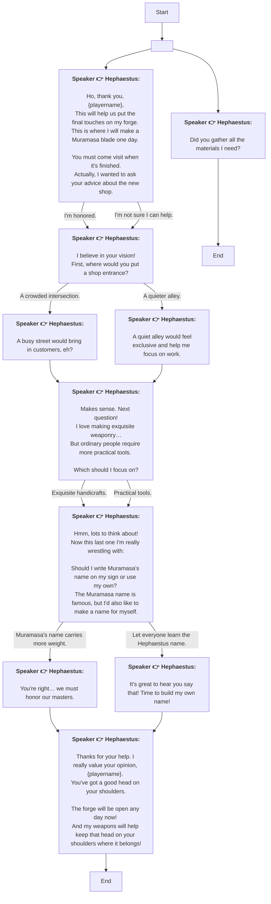

```mermaid
graph
Start -->1771884881694822[ ]
1771884881694822 -->1771884965989481[<b>Speaker 👉 Hephaestus:</b>
\nHo, thank you, &lbrace;playername&rbrace;,
This will help us put the final touches on my forge. 
This is where I will make a Muramasa blade one day. 
\nYou must come visit when it's finished.
Actually, I wanted to ask your advice about the new shop. 
]
1771884881694822 -->1771885031756906[<b>Speaker 👉 Hephaestus:</b>
\nDid you gather all the materials I need?]
1771884965989481 -->|I'm honored.|1771885147568244[<b>Speaker 👉 Hephaestus:</b>
\nI believe in your vision!
First, where would you put a shop entrance?
]
1771884965989481 -->|I'm not sure I can help.|1771885147568244[<b>Speaker 👉 Hephaestus:</b>
\nI believe in your vision!
First, where would you put a shop entrance?
]
1771885147568244 -->|A crowded intersection. |1771885191321722[<b>Speaker 👉 Hephaestus:</b>
\nA busy street would bring in customers, eh?  
]
1771885147568244 -->|A quieter alley. |1771885211738235[<b>Speaker 👉 Hephaestus:</b>
\n A quiet alley would feel exclusive and help me focus on work. 
]
1771885191321722 -->1771885257513097[<b>Speaker 👉 Hephaestus:</b>
\nMakes sense. Next question!
I love making exquisite weaponry…
But ordinary people require more practical tools. 
\nWhich should I focus on? ]
1771885257513097 -->|Exquisite handicrafts.|1771885330352271[<b>Speaker 👉 Hephaestus:</b>
\nHmm, lots to think about!
Now this last one I'm really wrestling with:
\nShould I write Muramasa's name on my sign or use my own? 
The Muramasa name is famous, but I'd also like to make a name for myself. 
]
1771885257513097 -->|Practical tools. |1771885330352271[<b>Speaker 👉 Hephaestus:</b>
\nHmm, lots to think about!
Now this last one I'm really wrestling with:
\nShould I write Muramasa's name on my sign or use my own? 
The Muramasa name is famous, but I'd also like to make a name for myself. 
]
1771885330352271 -->|Muramasa's name carries more weight. |1771885479830698[<b>Speaker 👉 Hephaestus:</b>
\nYou're right… we must honor our masters. 
]
1771885330352271 -->| Let everyone learn the Hephaestus name.|1771885499737259[<b>Speaker 👉 Hephaestus:</b>
\nIt's great to hear you say that! Time to build my own name!]
1771885479830698 -->1771885408403625[<b>Speaker 👉 Hephaestus:</b>
\nThanks for your help. I really value your opinion, &lbrace;playername&rbrace;. 
You've got a good head on your shoulders.
\nThe forge will be open any day now! 
And my weapons will help keep that head on your shoulders where it belongs!
]
1771885408403625 -->1771884944196712[End]
1771885499737259 -->1771885408403625[<b>Speaker 👉 Hephaestus:</b>
\nThanks for your help. I really value your opinion, &lbrace;playername&rbrace;. 
You've got a good head on your shoulders.
\nThe forge will be open any day now! 
And my weapons will help keep that head on your shoulders where it belongs!
]
1771885211738235 -->1771885257513097[<b>Speaker 👉 Hephaestus:</b>
\nMakes sense. Next question!
I love making exquisite weaponry…
But ordinary people require more practical tools. 
\nWhich should I focus on? ]
1771885031756906 -->1771888289456240[End]

```