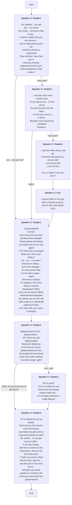

```mermaid
graph
Start -->1738447575181418[<b>Speaker 👉 Seabert:</b>
\nOk, Seabert... you got this... you know 
the words... you know what to say…\nIt doesn't matter that you are nervous... 
you're really good at your job 
and they will be so impressed!\nThey will think &quot;wow, that guy is 
amazing at doing paperwork and he sure 
looks handsome in that uniform&quot;]
1738447575181418 -->|*stay quiet*|1768524084245382[<b>Speaker 👉 Seabert:</b>
\n... I bet they won't even mention that 
it's too big for you... or that you're 
too short to look over the desk...\n... or that your voice is... 
is small... \nBecause you're gonna be confident! 
Fearless!...]
1738447575181418 -->|Um… Excuse me?|1768528440716181[<b>Speaker 👉 Seabert:</b>
\nGAAAAAHHHH\nOh NO! 
How long have you been standing there waiting!? 
Please ignore everything you heard and let me start again!\nH-hi! Welcome to stranger!
What can I do for you, Seikyu?\nAh... no... I m-meant welcome to Seikyu... 
you're the stranger...\nS-s-sorry about that! 
Let me start a-again… again!\nWelcome to Seikyu! 
I'm Seabert! This is the Seikyu Customs Registration Office 
and I am the town's Offical Administrative Assistant!\nSo, before you run off I will need to get your residential paperwork done.
Let's start with your name, s-stranger!]
1768524084245382 -->|*stay quiet*|1768524129524615[<b>Speaker 👉 Seabert:</b>
\n... and then they will go and tell 
everyone how good of a job you did!\n... you can do this...
... I can do this…\n…\nOh no, what if I can't do this!?]
1768524084245382 -->|Hello?|1768528440716181[<b>Speaker 👉 Seabert:</b>
\nGAAAAAHHHH\nOh NO! 
How long have you been standing there waiting!? 
Please ignore everything you heard and let me start again!\nH-hi! Welcome to stranger!
What can I do for you, Seikyu?\nAh... no... I m-meant welcome to Seikyu... 
you're the stranger...\nS-s-sorry about that! 
Let me start a-again… again!\nWelcome to Seikyu! 
I'm Seabert! This is the Seikyu Customs Registration Office 
and I am the town's Offical Administrative Assistant!\nSo, before you run off I will need to get your residential paperwork done.
Let's start with your name, s-stranger!]
1768524129524615 -->1768524189845389[<b>Speaker 👉 Fox:</b>
\nI cannot listen to this guy talk to himself anymore.\nUM HI! WE CAN HEAR YOU!]
1768524189845389 -->1768528440716181[<b>Speaker 👉 Seabert:</b>
\nGAAAAAHHHH\nOh NO! 
How long have you been standing there waiting!? 
Please ignore everything you heard and let me start again!\nH-hi! Welcome to stranger!
What can I do for you, Seikyu?\nAh... no... I m-meant welcome to Seikyu... 
you're the stranger...\nS-s-sorry about that! 
Let me start a-again… again!\nWelcome to Seikyu! 
I'm Seabert! This is the Seikyu Customs Registration Office 
and I am the town's Offical Administrative Assistant!\nSo, before you run off I will need to get your residential paperwork done.
Let's start with your name, s-stranger!]
1768528440716181 -->1738448731861105[<b>Speaker 👉 Seabert:</b>
\n&lbrace;playername&rbrace; uh-huh... &lbrace;playername&rbrace;...\nAh! There you are!
&lbrace;playername&rbrace;!
Welcome! Welcome!\nSo it's the two of you, &lbrace;playername&rbrace; and Kon.
You bought the farmhouse at the foot of the northern mountain range, right?]
1738448731861105 -->|Yes, I did!|1738453157967982[<b>Speaker 👉 Seabert:</b>
\nOh my gosh! 
I-I'm so excited for you!\nThat house has always looked really nice... 
I'm so happy someone's finally filling it!]
1738448731861105 -->|Yeah, do you know how to get there? |1768529659287446[<b>Speaker 👉 Seabert:</b>
\nYui is waiting for you up ahead. 
She'll tell you the location of the farmhouse.\nJust follow the path and try to get there before it's dark! 
Be careful... i-it can get scary at night…\nIf you get hungry, 
feel free to check out the Fisherman's Shop to the left of the dock.\nT-that's my uncle's shop!
Tell him that I said HI! ... and that you're new here he he...
He'll give you some guidance on what to do!\nN-now go a-and have fun, &lbrace;playername&rbrace;!]
1738453157967982 -->1768529659287446[<b>Speaker 👉 Seabert:</b>
\nYui is waiting for you up ahead. 
She'll tell you the location of the farmhouse.\nJust follow the path and try to get there before it's dark! 
Be careful... i-it can get scary at night…\nIf you get hungry, 
feel free to check out the Fisherman's Shop to the left of the dock.\nT-that's my uncle's shop!
Tell him that I said HI! ... and that you're new here he he...
He'll give you some guidance on what to do!\nN-now go a-and have fun, &lbrace;playername&rbrace;!]
1768529659287446 -->1738448411946096[End]

```