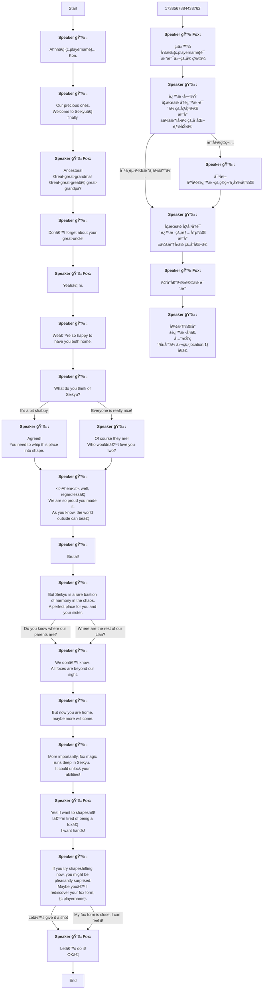

```mermaid
graph
Start -->1775372605654710[<b>Speaker 👉 :</b>
\nAhhh… &lbrace;c.playername&rbrace;... Kon.]
1775372605654710 -->1775372631379649[<b>Speaker 👉 :</b>
\nOur precious ones.
Welcome to Seikyu… finally.]
1775372631379649 -->1775372631379652[<b>Speaker 👉 Fox:</b>
\nAncestors!
Great-great-grandma! 
Great-great-great… great-grandpa?]
1775372631379652 -->1775372631379655[<b>Speaker 👉 :</b>
\nDon’t forget about your great-uncle!]
1775372631379655 -->1775372631379658[<b>Speaker 👉 Fox:</b>
\nYeah… hi.]
1775372631379658 -->1775372631380685[<b>Speaker 👉 :</b>
\nWe’re so happy to have you both home.]
1775372631380685 -->1775372631380688[<b>Speaker 👉 :</b>
\nWhat do you think of Seikyu?]
1775372631380688 -->|It's a bit shabby.|1775372631381723[<b>Speaker 👉 :</b>
\nAgreed!
You need to whip this place into shape.]
1775372631380688 -->|Everyone is really nice!|1775372771863289[<b>Speaker 👉 :</b>
\nOf course they are!
Who wouldn’t love you two?]
1775372631381723 -->1775372631382750[<b>Speaker 👉 :</b>
\n&lt;i&gt;Ahem&lt;/i&gt;, well, regardless…\nWe are so proud you made it.
As you know, the world outside can be…]
1775372631382750 -->1775372631382755[<b>Speaker 👉 :</b>
\nBrutal!]
1775372631382755 -->1775372631382758[<b>Speaker 👉 :</b>
\nBut Seikyu is a rare bastion of harmony in the chaos.
A perfect place for you and your sister.]
1775372631382758 -->|Do you know where our parents are?|1775373019161348[<b>Speaker 👉 :</b>
\nWe don’t know. 
All foxes are beyond our sight.]
1775372631382758 -->|Where are the rest of our clan?|1775373019161348[<b>Speaker 👉 :</b>
\nWe don’t know. 
All foxes are beyond our sight.]
1775373019161348 -->1775373019161351[<b>Speaker 👉 :</b>
\nBut now you are home, maybe more will come.]
1775373019161351 -->1775373057625866[<b>Speaker 👉 :</b>
\nMore importantly, fox magic runs deep in Seikyu.  
It could unlock your abilities!]
1775373057625866 -->1775373075592973[<b>Speaker 👉 Fox:</b>
\nYes! I want to shapeshift!
I’m tired of being a fox… 
I want hands!]
1775373075592973 -->1775373087719184[<b>Speaker 👉 :</b>
\nIf you try shapeshifting now, you might be pleasantly surprised.
Maybe you’ll rediscover your fox form, &lbrace;c.playername&rbrace;.]
1775373087719184 -->|Let’s give it a shot|1775373143912270[<b>Speaker 👉 Fox:</b>
\nLet’s do it!
OK…]
1775373087719184 -->|My fox form is close, I can feel it!|1775373143912270[<b>Speaker 👉 Fox:</b>
\nLet’s do it!
OK…]
1775373143912270 -->1773237270939983[End]
1775372771863289 -->1775372631382750[<b>Speaker 👉 :</b>
\n&lt;i&gt;Ahem&lt;/i&gt;, well, regardless…\nWe are so proud you made it.
As you know, the world outside can be…]
1738567884438762 -->1751470966013239[<b>Speaker 👉 Fox:</b>
\nç‹ä»™ï¼
刚æ‰&lbrace;c.playername&rbrace;说我是他的宠物ï¼]
1751470966013239 -->1751471393183033[<b>Speaker 👉 :</b>
\n这样å—？
如æœä½ å†è¿™æ ·è¯´ä½ çš„妹妹，
我就会收å›ä½ çš„å˜åŒ–能力。]
1751471393183033 -->|我开ç©ç¬‘...|1751471477905726[<b>Speaker 👉 :</b>
\n对外人开这样的ç©ç¬‘ä¸å¥½å§ï¼Œ]
1751471393183033 -->|对ä¸èµ·ï¼Œæˆ‘ä¸ä¼šäº†ã€‚|1751471591685440[<b>Speaker 👉 :</b>
\n如æœä½ å¦¹å¦¹å†è¯´è¿™æ ·çš„情况，
我就会收å›ä½ çš„å˜åŒ–。]
1751471477905726 -->1751471591685440[<b>Speaker 👉 :</b>
\n如æœä½ å¦¹å¦¹å†è¯´è¿™æ ·çš„情况，
我就会收å›ä½ çš„å˜åŒ–。]
1751471591685440 -->1751471518734655[<b>Speaker 👉 Fox:</b>
\n（å°å£°ï¼‰è®©ä½ è¯´æˆ‘]
1751471518734655 -->1751471654534465[<b>Speaker 👉 :</b>
\n好了，就这样å§ã€‚
先抓紧å›åˆ°ä½ ä»¬çš„&lbrace;location.1&rbrace;å§ã€‚]

```