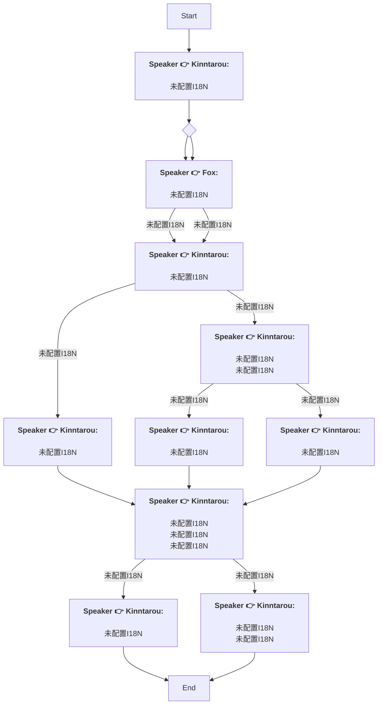

```mermaid
graph
Start -->1738969370984625[<b>Speaker 👉 Kinntarou:</b>
\n未配置I18N]
1738969370984625 -->1776863045784235{ }
1776863045784235 -->1776862995807912[<b>Speaker 👉 Fox:</b>
\n未配置I18N]
1776863045784235 -->1776862995807912[<b>Speaker 👉 Fox:</b>
\n未配置I18N]
1776862995807912 -->|未配置I18N|1776863082286769[<b>Speaker 👉 Kinntarou:</b>
\n未配置I18N]
1776862995807912 -->|未配置I18N|1776863082286769[<b>Speaker 👉 Kinntarou:</b>
\n未配置I18N]
1776863082286769 -->|未配置I18N|1776863135045307[<b>Speaker 👉 Kinntarou:</b>
\n未配置I18N]
1776863082286769 -->|未配置I18N|1776863145189054[<b>Speaker 👉 Kinntarou:</b>
\n未配置I18N\n未配置I18N]
1776863135045307 -->1776863185270472[<b>Speaker 👉 Kinntarou:</b>
\n未配置I18N\n未配置I18N\n未配置I18N]
1776863185270472 -->|未配置I18N|1776863785747162[<b>Speaker 👉 Kinntarou:</b>
\n未配置I18N]
1776863185270472 -->|未配置I18N|1776863815620319[<b>Speaker 👉 Kinntarou:</b>
\n未配置I18N\n未配置I18N]
1776863785747162 -->1738969370984626[End]
1776863815620319 -->1738969370984626[End]
1776863145189054 -->|未配置I18N|1776863369582288[<b>Speaker 👉 Kinntarou:</b>
\n未配置I18N]
1776863145189054 -->|未配置I18N|1776863219836620[<b>Speaker 👉 Kinntarou:</b>
\n未配置I18N]
1776863219836620 -->1776863185270472[<b>Speaker 👉 Kinntarou:</b>
\n未配置I18N\n未配置I18N\n未配置I18N]
1776863369582288 -->1776863185270472[<b>Speaker 👉 Kinntarou:</b>
\n未配置I18N\n未配置I18N\n未配置I18N]

```