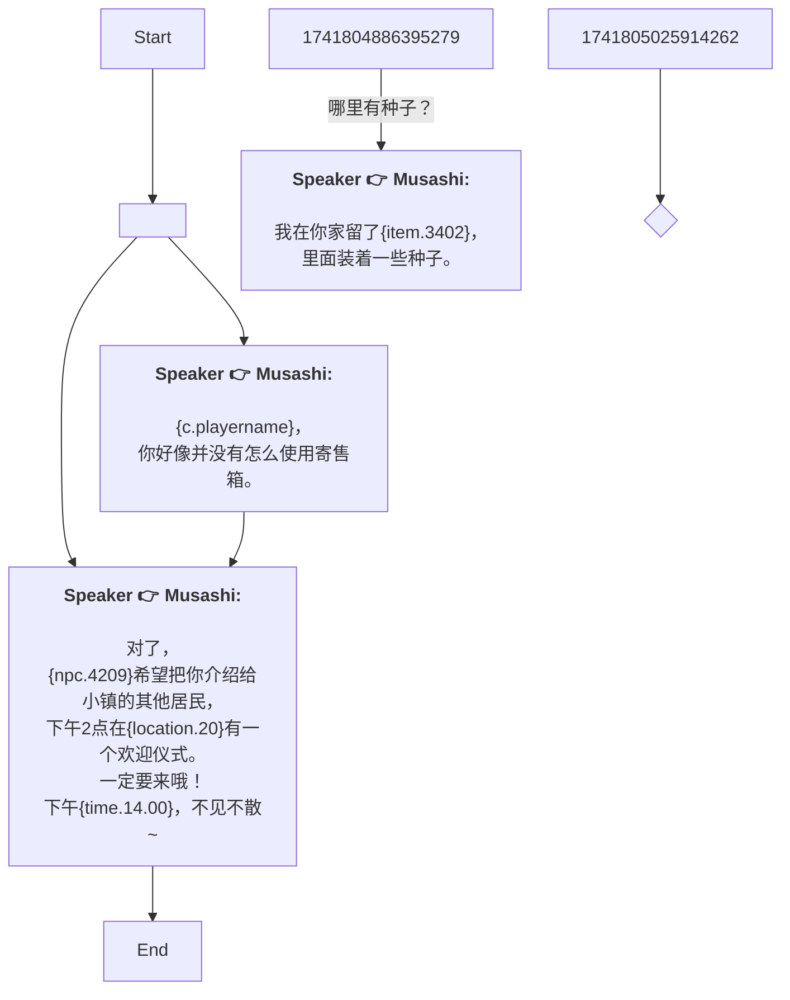

```mermaid
graph
Start -->1762595293475517[ ]
1762595293475517 -->1763771107802819[<b>Speaker 👉 Musashi:</b>
\n&lbrace;c.playername&rbrace;，
你好像并没有怎么使用寄售箱。]
1762595293475517 -->1741805123273116[<b>Speaker 👉 Musashi:</b>
\n对了，
&lbrace;npc.4209&rbrace;希望把你介绍给小镇的其他居民，
下午2点在&lbrace;location.20&rbrace;有一个欢迎仪式。\n一定要来哦！
下午&lbrace;time.14.00&rbrace;，不见不散~]
1763771107802819 -->1741805123273116[<b>Speaker 👉 Musashi:</b>
\n对了，
&lbrace;npc.4209&rbrace;希望把你介绍给小镇的其他居民，
下午2点在&lbrace;location.20&rbrace;有一个欢迎仪式。\n一定要来哦！
下午&lbrace;time.14.00&rbrace;，不见不散~]
1741805123273116 -->1741805387044261[End]
1741804886395279 -->|哪里有种子？|1741804982096277[<b>Speaker 👉 Musashi:</b>
\n我在你家留了&lbrace;item.3402&rbrace;，
里面装着一些种子。]
1741805025914262 -->1741805099132311{ }

```