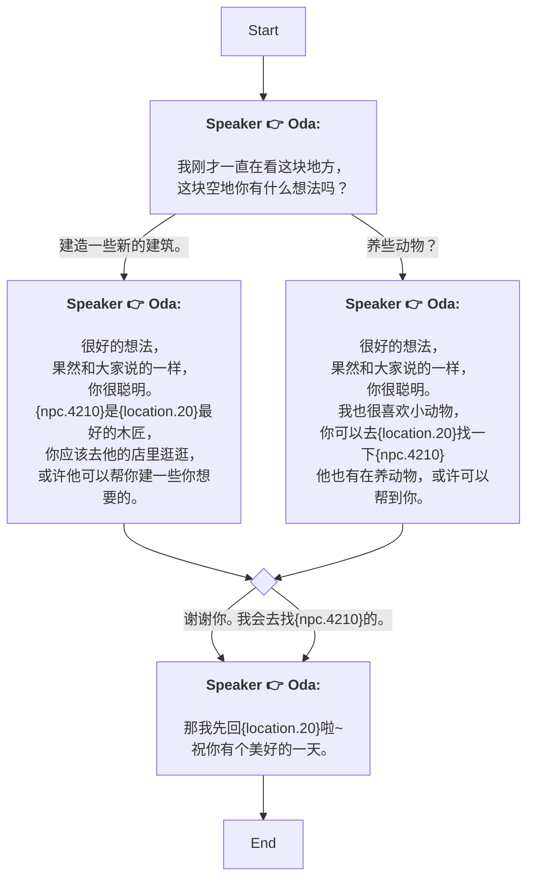

```mermaid
graph
Start -->1741841646748178[<b>Speaker 👉 Oda:</b>
\n我刚才一直在看这块地方，
这块空地你有什么想法吗？]
1741841646748178 -->|养些动物？|1741841646749209[<b>Speaker 👉 Oda:</b>
\n很好的想法，
果然和大家说的一样，
你很聪明。\n我也很喜欢小动物，
你可以去&lbrace;location.20&rbrace;找一下&lbrace;npc.4210&rbrace;
他也有在养动物，或许可以帮到你。]
1741841646748178 -->|建造一些新的建筑。|1741841646749206[<b>Speaker 👉 Oda:</b>
\n很好的想法，
果然和大家说的一样，
你很聪明。\n&lbrace;npc.4210&rbrace;是&lbrace;location.20&rbrace;最好的木匠，
你应该去他的店里逛逛，
或许他可以帮你建一些你想要的。]
1741841646749206 -->435460411687301{ }
1741841683131941 -->1741841662675490[End]
1741841646749209 -->435460411687301{ }
435460411687301 -->|谢谢你。|1741841683131941[<b>Speaker 👉 Oda:</b>
\n那我先回&lbrace;location.20&rbrace;啦~
祝你有个美好的一天。]
435460411687301 -->|我会去找&lbrace;npc.4210&rbrace;的。|1741841683131941[<b>Speaker 👉 Oda:</b>
\n那我先回&lbrace;location.20&rbrace;啦~
祝你有个美好的一天。]

```