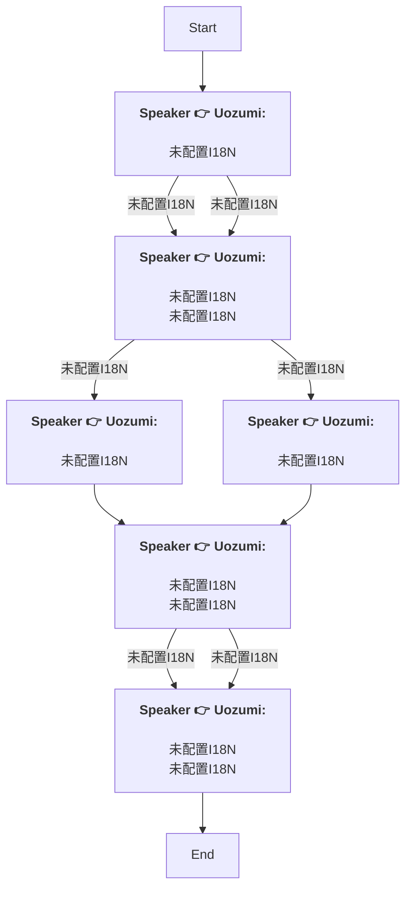

```mermaid
graph
Start -->1754546165802936[<b>Speaker 👉 Uozumi:</b>
\n未配置I18N]
1754546165802936 -->|未配置I18N|1754548441282496[<b>Speaker 👉 Uozumi:</b>
\n未配置I18N\n未配置I18N]
1754546165802936 -->|未配置I18N|1754548441282496[<b>Speaker 👉 Uozumi:</b>
\n未配置I18N\n未配置I18N]
1754548441282496 -->|未配置I18N|1754550466679751[<b>Speaker 👉 Uozumi:</b>
\n未配置I18N]
1754548441282496 -->|未配置I18N|1754550460743622[<b>Speaker 👉 Uozumi:</b>
\n未配置I18N]
1754550460743622 -->1754550945276872[<b>Speaker 👉 Uozumi:</b>
\n未配置I18N\n未配置I18N]
1754550945276872 -->|未配置I18N|1754552698678222[<b>Speaker 👉 Uozumi:</b>
\n未配置I18N\n未配置I18N]
1754550945276872 -->|未配置I18N|1754552698678222[<b>Speaker 👉 Uozumi:</b>
\n未配置I18N\n未配置I18N]
1754552698678222 -->1754557476095951[End]
1754550466679751 -->1754550945276872[<b>Speaker 👉 Uozumi:</b>
\n未配置I18N\n未配置I18N]

```