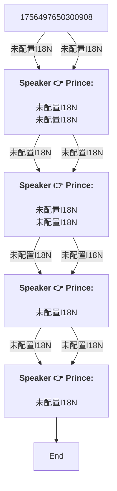

```mermaid
graph
1756497650300908 -->|未配置I18N|1756498992332793[<b>Speaker 👉 Prince:</b>
\n未配置I18N\n未配置I18N]
1756497650300908 -->|未配置I18N|1756498992332793[<b>Speaker 👉 Prince:</b>
\n未配置I18N\n未配置I18N]
1756498992332793 -->|未配置I18N|1756504511335426[<b>Speaker 👉 Prince:</b>
\n未配置I18N\n未配置I18N]
1756498992332793 -->|未配置I18N|1756504511335426[<b>Speaker 👉 Prince:</b>
\n未配置I18N\n未配置I18N]
1756504511335426 -->|未配置I18N|1756505809446922[<b>Speaker 👉 Prince:</b>
\n未配置I18N]
1756504511335426 -->|未配置I18N|1756505809446922[<b>Speaker 👉 Prince:</b>
\n未配置I18N]
1756505809446922 -->|未配置I18N|1756506273310736[<b>Speaker 👉 Prince:</b>
\n未配置I18N]
1756505809446922 -->|未配置I18N|1756506273310736[<b>Speaker 👉 Prince:</b>
\n未配置I18N]
1756506273310736 -->1756506300503057[End]

```