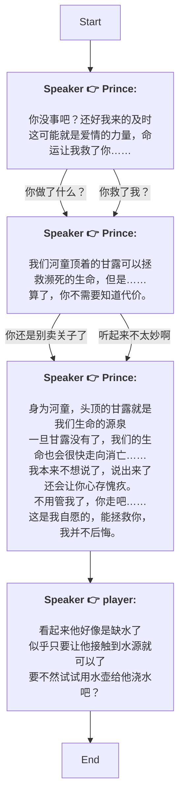

```mermaid
graph
Start -->1758079600629293[<b>Speaker 👉 Prince:</b>
\n你没事吧？还好我来的及时
这可能就是爱情的力量，命运让我救了你……]
1758079600629293 -->|你做了什么？|1758079630013998[<b>Speaker 👉 Prince:</b>
\n我们河童顶着的甘露可以拯救濒死的生命，但是……
算了，你不需要知道代价。]
1758079600629293 -->|你救了我？|1758079630013998[<b>Speaker 👉 Prince:</b>
\n我们河童顶着的甘露可以拯救濒死的生命，但是……
算了，你不需要知道代价。]
1758079630013998 -->|你还是别卖关子了|1758080090447418[<b>Speaker 👉 Prince:</b>
\n身为河童，头顶的甘露就是我们生命的源泉
一旦甘露没有了，我们的生命也会很快走向消亡……\n我本来不想说了，说出来了还会让你心存愧疚。
不用管我了，你走吧……
这是我自愿的，能拯救你，我并不后悔。]
1758079630013998 -->|听起来不太妙啊|1758080090447418[<b>Speaker 👉 Prince:</b>
\n身为河童，头顶的甘露就是我们生命的源泉
一旦甘露没有了，我们的生命也会很快走向消亡……\n我本来不想说了，说出来了还会让你心存愧疚。
不用管我了，你走吧……
这是我自愿的，能拯救你，我并不后悔。]
1758080090447418 -->1758080284909115[<b>Speaker 👉 player:</b>
\n看起来他好像是缺水了
似乎只要让他接触到水源就可以了
要不然试试用水壶给他浇水吧？]
1758080284909115 -->1758080325624380[End]

```