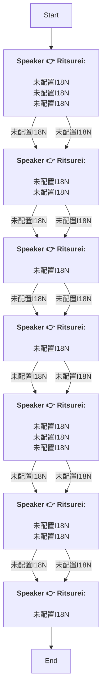

```mermaid
graph
Start -->1758349408510534[<b>Speaker 👉 Ritsurei:</b>
\n未配置I18N\n未配置I18N\n未配置I18N]
1758349408510534 -->|未配置I18N|1758351422177868[<b>Speaker 👉 Ritsurei:</b>
\n未配置I18N\n未配置I18N]
1758349408510534 -->|未配置I18N|1758351422177868[<b>Speaker 👉 Ritsurei:</b>
\n未配置I18N\n未配置I18N]
1758351422177868 -->|未配置I18N|1758352166443602[<b>Speaker 👉 Ritsurei:</b>
\n未配置I18N]
1758351422177868 -->|未配置I18N|1758352166443602[<b>Speaker 👉 Ritsurei:</b>
\n未配置I18N]
1758352166443602 -->|未配置I18N|1758352479594073[<b>Speaker 👉 Ritsurei:</b>
\n未配置I18N]
1758352166443602 -->|未配置I18N|1758352479594073[<b>Speaker 👉 Ritsurei:</b>
\n未配置I18N]
1758352479594073 -->|未配置I18N|1758352687134303[<b>Speaker 👉 Ritsurei:</b>
\n未配置I18N\n未配置I18N\n未配置I18N]
1758352479594073 -->|未配置I18N|1758352687134303[<b>Speaker 👉 Ritsurei:</b>
\n未配置I18N\n未配置I18N\n未配置I18N]
1758352687134303 -->|未配置I18N|1758354845234789[<b>Speaker 👉 Ritsurei:</b>
\n未配置I18N\n未配置I18N]
1758352687134303 -->|未配置I18N|1758354845234789[<b>Speaker 👉 Ritsurei:</b>
\n未配置I18N\n未配置I18N]
1758354845234789 -->|未配置I18N|1758355546907243[<b>Speaker 👉 Ritsurei:</b>
\n未配置I18N]
1758354845234789 -->|未配置I18N|1758355546907243[<b>Speaker 👉 Ritsurei:</b>
\n未配置I18N]
1758355546907243 -->1758355777149548[End]

```