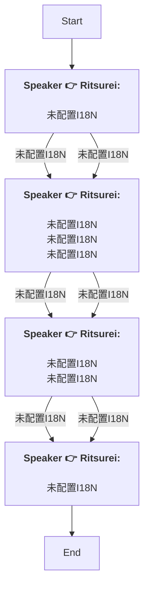

```mermaid
graph
Start -->1758364019714689[<b>Speaker 👉 Ritsurei:</b>
\n未配置I18N]
1758364019714689 -->|未配置I18N|1758364630048391[<b>Speaker 👉 Ritsurei:</b>
\n未配置I18N\n未配置I18N\n未配置I18N]
1758364019714689 -->|未配置I18N|1758364630048391[<b>Speaker 👉 Ritsurei:</b>
\n未配置I18N\n未配置I18N\n未配置I18N]
1758364630048391 -->|未配置I18N|1758365048720013[<b>Speaker 👉 Ritsurei:</b>
\n未配置I18N\n未配置I18N]
1758364630048391 -->|未配置I18N|1758365048720013[<b>Speaker 👉 Ritsurei:</b>
\n未配置I18N\n未配置I18N]
1758365048720013 -->|未配置I18N|1758365455139475[<b>Speaker 👉 Ritsurei:</b>
\n未配置I18N]
1758365048720013 -->|未配置I18N|1758365455139475[<b>Speaker 👉 Ritsurei:</b>
\n未配置I18N]
1758365455139475 -->1758365496731284[End]

```