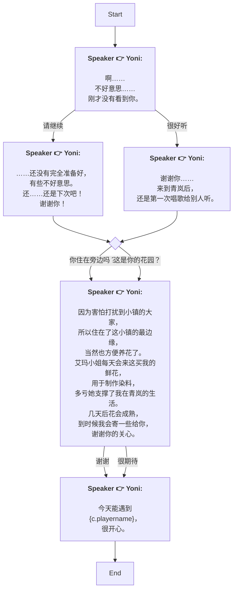

```mermaid
graph
Start -->1762964737821388[<b>Speaker 👉 Yoni:</b>
\n啊……
不好意思……
刚才没有看到你。]
1762964737821388 -->|请继续|1762965129398997[<b>Speaker 👉 Yoni:</b>
\n……还没有完全准备好，
有些不好意思。\n还……还是下次吧！
谢谢你！]
1762964737821388 -->|很好听|1762964880279252[<b>Speaker 👉 Yoni:</b>
\n谢谢你……
来到青岚后，
还是第一次唱歌给别人听。]
1762965129398997 -->440741282349749{ }
1762965159805654 -->|谢谢|1762965391964898[<b>Speaker 👉 Yoni:</b>
\n今天能遇到&lbrace;c.playername&rbrace;，
很开心。]
1762965159805654 -->|很期待|1762965391964898[<b>Speaker 👉 Yoni:</b>
\n今天能遇到&lbrace;c.playername&rbrace;，
很开心。]
1762965391964898 -->1762965405605603[End]
440741282349749 -->|你住在旁边吗？|1762965159805654[<b>Speaker 👉 Yoni:</b>
\n因为害怕打扰到小镇的大家，
所以住在了这小镇的最边缘，
当然也方便养花了。\n艾玛小姐每天会来这买我的鲜花，
用于制作染料，
多亏她支撑了我在青岚的生活。\n几天后花会成熟，
到时候我会寄一些给你，
谢谢你的关心。]
440741282349749 -->|这是你的花园？|1762965159805654[<b>Speaker 👉 Yoni:</b>
\n因为害怕打扰到小镇的大家，
所以住在了这小镇的最边缘，
当然也方便养花了。\n艾玛小姐每天会来这买我的鲜花，
用于制作染料，
多亏她支撑了我在青岚的生活。\n几天后花会成熟，
到时候我会寄一些给你，
谢谢你的关心。]
1762964880279252 -->440741282349749{ }

```