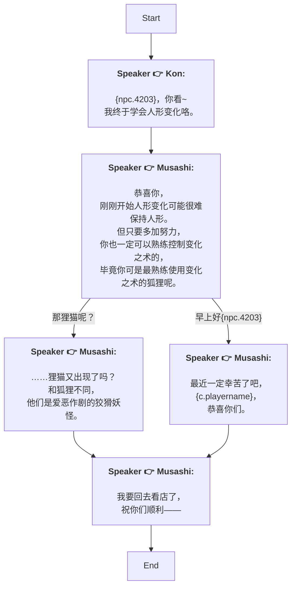

```mermaid
graph
Start -->1764896149598957[<b>Speaker 👉 Kon:</b>
\n&lbrace;npc.4203&rbrace;，你看~
我终于学会人形变化咯。]
1764896149598957 -->1764896206404334[<b>Speaker 👉 Musashi:</b>
\n恭喜你，
刚刚开始人形变化可能很难保持人形。\n但只要多加努力，
你也一定可以熟练控制变化之术的，
毕竟你可是最熟练使用变化之术的狐狸呢。]
1764896206404334 -->|早上好&lbrace;npc.4203&rbrace;|1764896819869430[<b>Speaker 👉 Musashi:</b>
\n最近一定幸苦了吧，
&lbrace;c.playername&rbrace;，
恭喜你们。]
1764896206404334 -->|那狸猫呢？|1764896485678837[<b>Speaker 👉 Musashi:</b>
\n……狸猫又出现了吗？
和狐狸不同，
他们是爱恶作剧的狡猾妖怪。]
1764896485678837 -->1764897063259897[<b>Speaker 👉 Musashi:</b>
\n我要回去看店了，
祝你们顺利——]
1764897063259897 -->1764897053379320[End]
1764896819869430 -->1764897063259897[<b>Speaker 👉 Musashi:</b>
\n我要回去看店了，
祝你们顺利——]

```