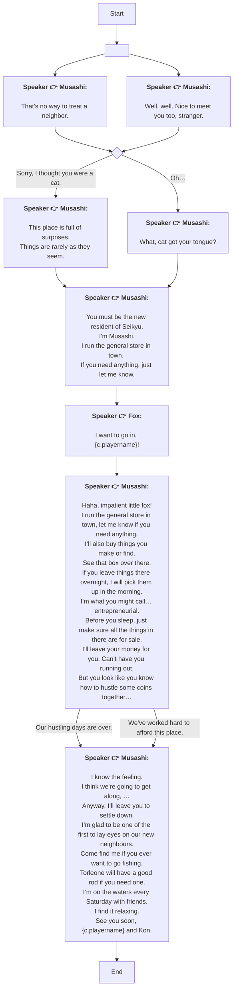

```mermaid
graph
Start -->1775423896390413[ ]
1775423896390413 -->1768547359690886[<b>Speaker 👉 Musashi:</b>
\nThat's no way to treat a neighbor.]
1775423896390413 -->1775423992003348[<b>Speaker 👉 Musashi:</b>
\nWell, well. Nice to meet you too, stranger.]
1768547359690886 -->442136839922721{ }
1768547359692938 -->1768547359696011[<b>Speaker 👉 Musashi:</b>
\nYou must be the new resident of Seikyu.
I'm Musashi.\nI run the general store in town. 
If you need anything, just let me know.]
1768547359696011 -->1775424439715171[<b>Speaker 👉 Fox:</b>
\nI want to go in, &lbrace;c.playername&rbrace;!]
1775424439715171 -->1775424467173733[<b>Speaker 👉 Musashi:</b>
\nHaha, impatient little fox!
I run the general store in town, let me know if you need anything.
I’ll also buy things you make or find.\nSee that box over there.
If you leave things there overnight, I will pick them up in the morning.
I’m what you might call… entrepreneurial.\nBefore you sleep, just make sure all the things in there are for sale.
I’ll leave your money for you. Can’t have you running out.
But you look like you know how to hustle some coins together…]
1775424467173733 -->|Our hustling days are over.|1768547359698063[<b>Speaker 👉 Musashi:</b>
\nI know the feeling.
I think we're going to get along, …\nAnyway, I’ll leave you to settle down.
I’m glad to be one of the first to lay eyes on our new neighbours.\nCome find me if you ever want to go fishing.
Torleone will have a good rod if you need one.\nI’m on the waters every Saturday with friends.
I find it relaxing.\nSee you soon, &lbrace;c.playername&rbrace; and Kon.]
1775424467173733 -->|We've worked hard to afford this place.|1768547359698063[<b>Speaker 👉 Musashi:</b>
\nI know the feeling.
I think we're going to get along, …\nAnyway, I’ll leave you to settle down.
I’m glad to be one of the first to lay eyes on our new neighbours.\nCome find me if you ever want to go fishing.
Torleone will have a good rod if you need one.\nI’m on the waters every Saturday with friends.
I find it relaxing.\nSee you soon, &lbrace;c.playername&rbrace; and Kon.]
1768547359698063 -->1768547372003494[End]
1768547359707287 -->1768547359696011[<b>Speaker 👉 Musashi:</b>
\nYou must be the new resident of Seikyu.
I'm Musashi.\nI run the general store in town. 
If you need anything, just let me know.]
1775423992003348 -->442136839922721{ }
442136839922721 -->|Sorry, I thought you were a cat.|1768547359692938[<b>Speaker 👉 Musashi:</b>
\nThis place is full of surprises.
Things are rarely as they seem.]
442136839922721 -->|Oh…|1768547359707287[<b>Speaker 👉 Musashi:</b>
\nWhat, cat got your tongue?]

```