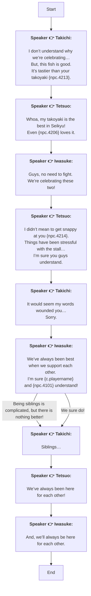

```mermaid
graph
Start -->1776840752326100[<b>Speaker 👉 Takichi:</b>
\nI don’t understand why we’re celebrating…
But, this fish is good.
It’s tastier than your takoyaki &lbrace;npc.4213&rbrace;.]
1776840752326100 -->1776840770254293[<b>Speaker 👉 Tetsuo:</b>
\nWhoa, my takoyaki is the best in Seikyu!
Even &lbrace;npc.4206&rbrace; loves it.]
1776840770254293 -->1776840782343639[<b>Speaker 👉 Iwasuke:</b>
\nGuys, no need to fight. 
We’re celebrating these two!]
1776840782343639 -->1776840794819033[<b>Speaker 👉 Tetsuo:</b>
\nI didn’t mean to get snappy at you &lbrace;npc.4214&rbrace;.
Things have been stressful with the stall…
I’m sure you guys understand.]
1776840794819033 -->1776840808946140[<b>Speaker 👉 Takichi:</b>
\nIt would seem my words wounded you…
Sorry.]
1776840808946140 -->1776840821327326[<b>Speaker 👉 Iwasuke:</b>
\nWe’ve always been best when we support each other. 
I’m sure &lbrace;c.playername&rbrace; and &lbrace;npc.4101&rbrace; understand!]
1776840821327326 -->|Being siblings is complicated, but there is nothing better!|1776840889359846[<b>Speaker 👉 Takichi:</b>
\nSiblings…]
1776840821327326 -->|We sure do!|1776840889359846[<b>Speaker 👉 Takichi:</b>
\nSiblings…]
1776840889359846 -->1776840907137513[<b>Speaker 👉 Tetsuo:</b>
\nWe’ve always been here for each other!]
1776840907137513 -->1776840931048940[<b>Speaker 👉 Iwasuke:</b>
\nAnd, we’ll always be here for each other.]
1776840931048940 -->1776840942424559[End]

```