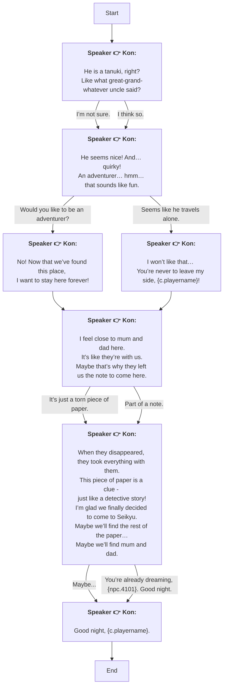

```mermaid
graph
Start -->1776858832992916[<b>Speaker 👉 Kon:</b>
\nHe is a tanuki, right?
Like what great-grand-whatever uncle said?]
1776858832992916 -->|I’m not sure.|1776858960251546[<b>Speaker 👉 Kon:</b>
\nHe seems nice! And… quirky!
An adventurer… hmm… that sounds like fun.]
1776858832992916 -->|I think so.|1776858960251546[<b>Speaker 👉 Kon:</b>
\nHe seems nice! And… quirky!
An adventurer… hmm… that sounds like fun.]
1776858960251546 -->|Would you like to be an adventurer?|1776858992188070[<b>Speaker 👉 Kon:</b>
\nNo! Now that we’ve found this place, 
I want to stay here forever!]
1776858960251546 -->|Seems like he travels alone.|1776859002782377[<b>Speaker 👉 Kon:</b>
\nI won’t like that… 
You’re never to leave my side, &lbrace;c.playername&rbrace;!]
1776858992188070 -->1776859142912684[<b>Speaker 👉 Kon:</b>
\nI feel close to mum and dad here.
It’s like they’re with us.
Maybe that’s why they left us the note to come here.]
1776859142912684 -->|It’s just a torn piece of paper.|1776859264572086[<b>Speaker 👉 Kon:</b>
\nWhen they disappeared, they took everything with them.
This piece of paper is a clue - 
just like a detective story!\nI’m glad we finally decided to come to Seikyu.
Maybe we’ll find the rest of the paper…
Maybe we’ll find mum and dad.]
1776859142912684 -->|Part of a note.|1776859264572086[<b>Speaker 👉 Kon:</b>
\nWhen they disappeared, they took everything with them.
This piece of paper is a clue - 
just like a detective story!\nI’m glad we finally decided to come to Seikyu.
Maybe we’ll find the rest of the paper…
Maybe we’ll find mum and dad.]
1776859264572086 -->|Maybe...|1776859837523654[<b>Speaker 👉 Kon:</b>
\nGood night, &lbrace;c.playername&rbrace;.]
1776859264572086 -->|You’re already dreaming, &lbrace;npc.4101&rbrace;. Good night.|1776859837523654[<b>Speaker 👉 Kon:</b>
\nGood night, &lbrace;c.playername&rbrace;.]
1776859837523654 -->1776859802488517[End]
1776859002782377 -->1776859142912684[<b>Speaker 👉 Kon:</b>
\nI feel close to mum and dad here.
It’s like they’re with us.
Maybe that’s why they left us the note to come here.]

```