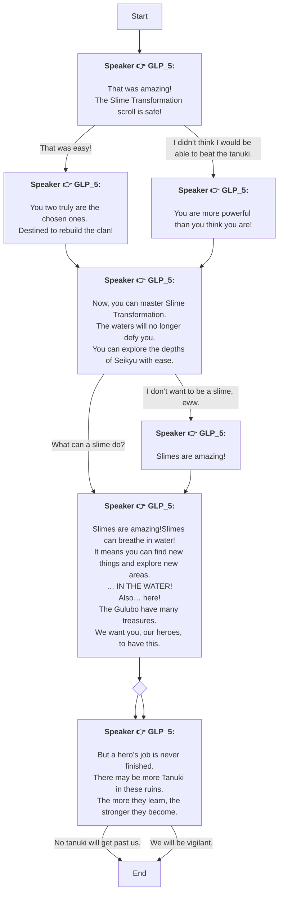

```mermaid
graph
Start -->1777659422723805[<b>Speaker 👉 GLP_5:</b>
\nThat was amazing!
The Slime Transformation scroll is safe!]
1777659422723805 -->|That was easy!|1777659464659683[<b>Speaker 👉 GLP_5:</b>
\nYou two truly are the chosen ones. 
Destined to rebuild the clan!]
1777659422723805 -->|I didn’t think I would be able to beat the tanuki.|1777659540779748[<b>Speaker 👉 GLP_5:</b>
\nYou are more powerful than you think you are!]
1777659464659683 -->1777659621365478[<b>Speaker 👉 GLP_5:</b>
\nNow, you can master Slime Transformation.
The waters will no longer defy you.
You can explore the depths of Seikyu with ease.]
1777659621365478 -->|I don’t want to be a slime, eww.|1777659672144624[<b>Speaker 👉 GLP_5:</b>
\nSlimes are amazing!]
1777659621365478 -->|What can a slime do?|1777659679664882[<b>Speaker 👉 GLP_5:</b>
\nSlimes are amazing!Slimes can breathe in water!
It means you can find new things and explore new areas.
… IN THE WATER!\nAlso… here!
The Gulubo have many treasures.
We want you, our heroes, to have this.]
1777659672144624 -->1777659679664882[<b>Speaker 👉 GLP_5:</b>
\nSlimes are amazing!Slimes can breathe in water!
It means you can find new things and explore new areas.
… IN THE WATER!\nAlso… here!
The Gulubo have many treasures.
We want you, our heroes, to have this.]
1777659679664882 -->1777659963874037{ }
1777659963874037 -->1777660095565558[<b>Speaker 👉 GLP_5:</b>
\nBut a hero’s job is never finished.
There may be more Tanuki in these ruins.
The more they learn, the stronger they become.]
1777659963874037 -->1777660095565558[<b>Speaker 👉 GLP_5:</b>
\nBut a hero’s job is never finished.
There may be more Tanuki in these ruins.
The more they learn, the stronger they become.]
1777660095565558 -->|No tanuki will get past us.|1777660175805183[End]
1777660095565558 -->|We will be vigilant.|1777660175805183[End]
1777659540779748 -->1777659621365478[<b>Speaker 👉 GLP_5:</b>
\nNow, you can master Slime Transformation.
The waters will no longer defy you.
You can explore the depths of Seikyu with ease.]

```