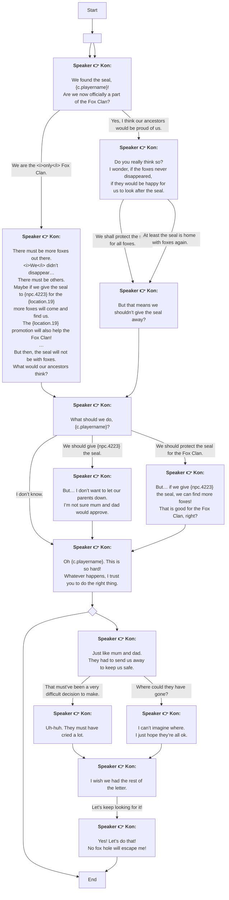

```mermaid
graph
Start -->1777824689964074[ ]
1777824689964074 -->1777824275454984[<b>Speaker 👉 Kon:</b>
\nWe found the seal, &lbrace;c.playername&rbrace;!
Are we now officially a part of the Fox Clan?]
1777824689964074 -->1777824275454984[<b>Speaker 👉 Kon:</b>
\nWe found the seal, &lbrace;c.playername&rbrace;!
Are we now officially a part of the Fox Clan?]
1777824275454984 -->|Yes, I think our ancestors would be proud of us.|1777824497341456[<b>Speaker 👉 Kon:</b>
\nDo you really think so?
I wonder, if the foxes never disappeared, 
if they would be happy for us to look after the seal.]
1777824275454984 -->|We are the &lt;i&gt;only&lt;/i&gt; Fox Clan.|1777824308296718[<b>Speaker 👉 Kon:</b>
\nThere must be more foxes out there.
&lt;i&gt;We&lt;/i&gt; didn’t disappear…
There must be others.\nMaybe if we give the seal to &lbrace;npc.4223&rbrace; for the &lbrace;location.19&rbrace;
more foxes will come and find us.
The &lbrace;location.19&rbrace; promotion will also help the Fox Clan!\n…\nBut then, the seal will not be with foxes.
What would our ancestors think?]
1777824308296718 -->1777824627868704[<b>Speaker 👉 Kon:</b>
\nWhat should we do, &lbrace;c.playername&rbrace;?]
1777824627868704 -->|I don’t know.|1777824774906938[<b>Speaker 👉 Kon:</b>
\nOh &lbrace;c.playername&rbrace;. This is so hard!\nWhatever happens, I trust you to do the right thing.]
1777824627868704 -->|We should protect the seal for the Fox Clan.|1777824757663799[<b>Speaker 👉 Kon:</b>
\nBut… if we give &lbrace;npc.4223&rbrace; the seal, we can find more foxes!
That is good for the Fox Clan, right?]
1777824627868704 -->|We should give &lbrace;npc.4223&rbrace; the seal.|1777824736567348[<b>Speaker 👉 Kon:</b>
\nBut… I don’t want to let our parents down.
I’m not sure mum and dad would approve.]
1777824736567348 -->1777824774906938[<b>Speaker 👉 Kon:</b>
\nOh &lbrace;c.playername&rbrace;. This is so hard!\nWhatever happens, I trust you to do the right thing.]
1777824774906938 -->1777832628543108{ }
1777832628543108 -->1777832662105733[<b>Speaker 👉 Kon:</b>
\nJust like mum and dad.
They had to send us away to keep us safe.]
1777832628543108 -->1777824880018493[End]
1777832662105733 -->|Where could they have gone?|1777832894241429[<b>Speaker 👉 Kon:</b>
\nI can’t imagine where.
I just hope they’re all ok.]
1777832662105733 -->|That must’ve been a very difficult decision to make.|1777832878231186[<b>Speaker 👉 Kon:</b>
\nUh-huh. They must have cried a lot.]
1777832878231186 -->1777832943568536[<b>Speaker 👉 Kon:</b>
\nI wish we had the rest of the letter.]
1777832943568536 -->|Let’s keep looking for it!|1777832971799202[<b>Speaker 👉 Kon:</b>
\nYes! Let’s do that!
No fox hole will escape me!]
1777832971799202 -->1777824880018493[End]
1777832894241429 -->1777832943568536[<b>Speaker 👉 Kon:</b>
\nI wish we had the rest of the letter.]
1777824757663799 -->1777824774906938[<b>Speaker 👉 Kon:</b>
\nOh &lbrace;c.playername&rbrace;. This is so hard!\nWhatever happens, I trust you to do the right thing.]
1777824497341456 -->| We shall protect the seal for all foxes.|1777824607126557[<b>Speaker 👉 Kon:</b>
\nBut that means we shouldn’t give the seal away?]
1777824497341456 -->|At least the seal is home with foxes again.|1777824607126557[<b>Speaker 👉 Kon:</b>
\nBut that means we shouldn’t give the seal away?]
1777824607126557 -->1777824627868704[<b>Speaker 👉 Kon:</b>
\nWhat should we do, &lbrace;c.playername&rbrace;?]

```