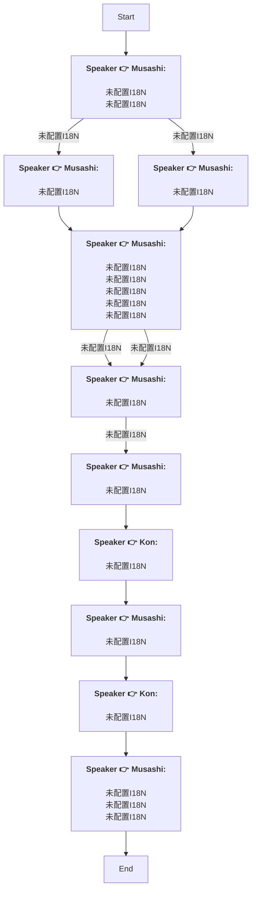

```mermaid
graph
Start -->1738369447807100[<b>Speaker 👉 Musashi:</b>
\n未配置I18N\n未配置I18N]
1738369447807100 -->|未配置I18N|1738369637289097[<b>Speaker 👉 Musashi:</b>
\n未配置I18N]
1738369447807100 -->|未配置I18N|1738369514544259[<b>Speaker 👉 Musashi:</b>
\n未配置I18N]
1738369514544259 -->1742696668586266[<b>Speaker 👉 Musashi:</b>
\n未配置I18N\n未配置I18N\n未配置I18N\n未配置I18N\n未配置I18N]
1742696668586266 -->|未配置I18N|1738369892088971[<b>Speaker 👉 Musashi:</b>
\n未配置I18N]
1742696668586266 -->|未配置I18N|1738369892088971[<b>Speaker 👉 Musashi:</b>
\n未配置I18N]
1738369892088971 -->|未配置I18N|1741542909956340[<b>Speaker 👉 Musashi:</b>
\n未配置I18N]
1741542909956340 -->1738369888274570[<b>Speaker 👉 Kon:</b>
\n未配置I18N]
1738369888274570 -->1768545209125798[<b>Speaker 👉 Musashi:</b>
\n未配置I18N]
1768545209125798 -->1768545232629671[<b>Speaker 👉 Kon:</b>
\n未配置I18N]
1768545232629671 -->1768545250768808[<b>Speaker 👉 Musashi:</b>
\n未配置I18N\n未配置I18N\n未配置I18N]
1768545250768808 -->1738370113018005[End]
1738369637289097 -->1742696668586266[<b>Speaker 👉 Musashi:</b>
\n未配置I18N\n未配置I18N\n未配置I18N\n未配置I18N\n未配置I18N]

```