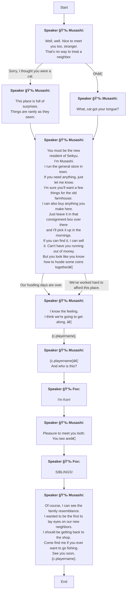

```mermaid
graph
Start -->1738369447807100[<b>Speaker 👉 Musashi:</b>
\nWell, well. Nice to meet you too, stranger.\nThat's no way to treat a neighbor.]
1738369447807100 -->|Sorry, I thought you were a cat.|1738369514544259[<b>Speaker 👉 Musashi:</b>
\nThis place is full of surprises.
Things are rarely as they seem.]
1738369447807100 -->|Oh…|1738369637289097[<b>Speaker 👉 Musashi:</b>
\nWhat, cat got your tongue?]
1738369514544259 -->1742696668586266[<b>Speaker 👉 Musashi:</b>
\nYou must be the new resident of Seikyu.
I'm Musashi.\nI run the general store in town. 
If you need anything, just let me know.\nI'm sure you'll want a few things for the old farmhouse. 
I can also buy anything you make here.\nJust leave it in that consignment box over there 
and I'll pick it up in the mornings. 
If you can find it, I can sell it. Can't have you running out of money.\nBut you look like you know how to hustle some coins together…]
1742696668586266 -->|Our hustling days are over.|1738369892088971[<b>Speaker 👉 Musashi:</b>
\nI know the feeling.
I think we're going to get along, …]
1742696668586266 -->|We've worked hard to afford this place.|1738369892088971[<b>Speaker 👉 Musashi:</b>
\nI know the feeling.
I think we're going to get along, …]
1738369892088971 -->|&lbrace;c.playername&rbrace;.|1741542909956340[<b>Speaker 👉 Musashi:</b>
\n&lbrace;c.playername&rbrace;…
And who is this?]
1741542909956340 -->1738369888274570[<b>Speaker 👉 Fox:</b>
\nI'm Kon!]
1738369888274570 -->1768545209125798[<b>Speaker 👉 Musashi:</b>
\nPleasure to meet you both. 
You two are…]
1768545209125798 -->1768545232629671[<b>Speaker 👉 Fox:</b>
\nSIBLINGS!]
1768545232629671 -->1768545250768808[<b>Speaker 👉 Musashi:</b>
\nOf course, I can see the family resemblance.
I wanted to be the first to lay eyes on our new neighbors.\nI should be getting back to the shop. 
Come find me if you ever want to go fishing.\nSee you soon, 
&lbrace;c.playername&rbrace;.]
1768545250768808 -->1738370113018005[End]
1738369637289097 -->1742696668586266[<b>Speaker 👉 Musashi:</b>
\nYou must be the new resident of Seikyu.
I'm Musashi.\nI run the general store in town. 
If you need anything, just let me know.\nI'm sure you'll want a few things for the old farmhouse. 
I can also buy anything you make here.\nJust leave it in that consignment box over there 
and I'll pick it up in the mornings. 
If you can find it, I can sell it. Can't have you running out of money.\nBut you look like you know how to hustle some coins together…]

```