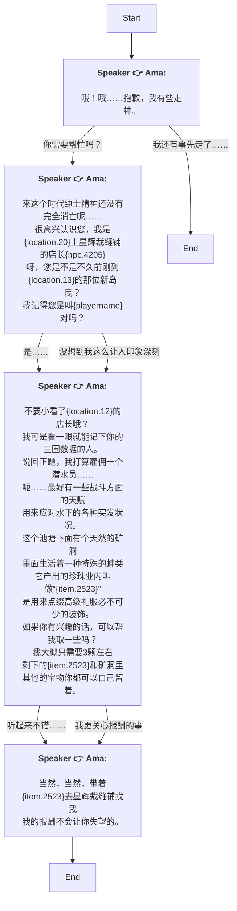

```mermaid
graph
Start -->1738789015900297[<b>Speaker 👉 Ama:</b>
\n哦！哦……抱歉，我有些走神。]
1738789015900297 -->|你需要帮忙吗？|1738791385681039[<b>Speaker 👉 Ama:</b>
\n来这个时代绅士精神还没有完全消亡呢……
很高兴认识您，我是&lbrace;location.20&rbrace;上星辉裁缝铺的店长&lbrace;npc.4205&rbrace;\n呀，您是不是不久前刚到&lbrace;location.13&rbrace;的那位新岛民？
我记得您是叫&lbrace;playername&rbrace;对吗？]
1738789015900297 -->|我还有事先走了……|1738791397645456[End]
1738791385681039 -->|是……|1738793950464150[<b>Speaker 👉 Ama:</b>
\n不要小看了&lbrace;location.12&rbrace;的店长哦？
我可是看一眼就能记下你的三围数据的人。\n说回正题，我打算雇佣一个潜水员……
呃……最好有一些战斗方面的天赋
用来应对水下的各种突发状况。\n这个池塘下面有个天然的矿洞
里面生活着一种特殊的蚌类\n它产出的珍珠业内叫做“&lbrace;item.2523&rbrace;”
是用来点缀高级礼服必不可少的装饰。\n如果你有兴趣的话，可以帮我取一些吗？
我大概只需要3颗左右
剩下的&lbrace;item.2523&rbrace;和矿洞里其他的宝物你都可以自己留着。]
1738791385681039 -->|没想到我这么让人印象深刻|1738793950464150[<b>Speaker 👉 Ama:</b>
\n不要小看了&lbrace;location.12&rbrace;的店长哦？
我可是看一眼就能记下你的三围数据的人。\n说回正题，我打算雇佣一个潜水员……
呃……最好有一些战斗方面的天赋
用来应对水下的各种突发状况。\n这个池塘下面有个天然的矿洞
里面生活着一种特殊的蚌类\n它产出的珍珠业内叫做“&lbrace;item.2523&rbrace;”
是用来点缀高级礼服必不可少的装饰。\n如果你有兴趣的话，可以帮我取一些吗？
我大概只需要3颗左右
剩下的&lbrace;item.2523&rbrace;和矿洞里其他的宝物你都可以自己留着。]
1738793950464150 -->|听起来不错……|1738794774083741[<b>Speaker 👉 Ama:</b>
\n当然，当然，带着&lbrace;item.2523&rbrace;去星辉裁缝铺找我
我的报酬不会让你失望的。]
1738793950464150 -->|我更关心报酬的事|1738794774083741[<b>Speaker 👉 Ama:</b>
\n当然，当然，带着&lbrace;item.2523&rbrace;去星辉裁缝铺找我
我的报酬不会让你失望的。]
1738794774083741 -->1738794837886110[End]

```