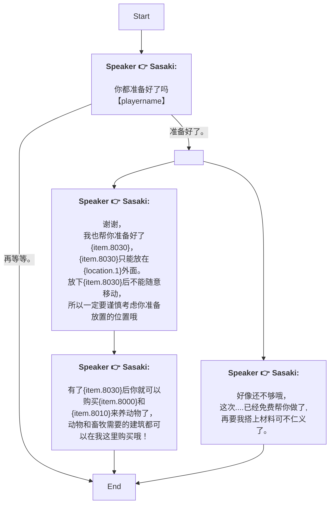

```mermaid
graph
Start -->1741371176241438[<b>Speaker 👉 Sasaki:</b>
\n你都准备好了吗
【playername】]
1741371176241438 -->|再等等。|1756425180201483[End]
1741371176241438 -->|准备好了。|1756425024283146[ ]
1756425024283146 -->1741371496490279[<b>Speaker 👉 Sasaki:</b>
\n好像还不够哦，
这次....已经免费帮你做了,
再要我搭上材料可不仁义了。]
1756425024283146 -->1741371646951720[<b>Speaker 👉 Sasaki:</b>
\n谢谢，
我也帮你准备好了&lbrace;item.8030&rbrace;，
&lbrace;item.8030&rbrace;只能放在&lbrace;location.1&rbrace;外面。\n放下&lbrace;item.8030&rbrace;后不能随意移动，
所以一定要谨慎考虑你准备放置的位置哦]
1741371646951720 -->1741372937941290[<b>Speaker 👉 Sasaki:</b>
\n有了&lbrace;item.8030&rbrace;后你就可以购买&lbrace;item.8000&rbrace;和&lbrace;item.8010&rbrace;来养动物了，
动物和畜牧需要的建筑都可以在我这里购买哦！]
1741372937941290 -->1756425180201483[End]
1741371496490279 -->1756425180201483[End]

```