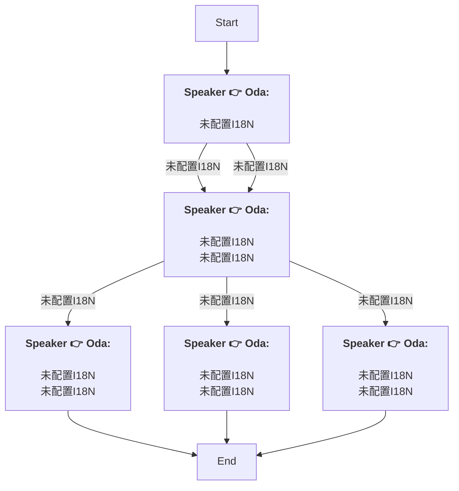

```mermaid
graph
Start -->1741756751534367[<b>Speaker 👉 Oda:</b>
\n未配置I18N]
1741756751534367 -->|未配置I18N|1741756751534371[<b>Speaker 👉 Oda:</b>
\n未配置I18N\n未配置I18N]
1741756751534367 -->|未配置I18N|1741756751534371[<b>Speaker 👉 Oda:</b>
\n未配置I18N\n未配置I18N]
1741756751534371 -->|未配置I18N|1741756751534375[<b>Speaker 👉 Oda:</b>
\n未配置I18N\n未配置I18N]
1741756751534371 -->|未配置I18N|1741758102220112[<b>Speaker 👉 Oda:</b>
\n未配置I18N\n未配置I18N]
1741756751534371 -->|未配置I18N|1741757998477647[<b>Speaker 👉 Oda:</b>
\n未配置I18N\n未配置I18N]
1741756751534375 -->1741757982916940[End]
1741757998477647 -->1741757982916940[End]
1741758102220112 -->1741757982916940[End]

```